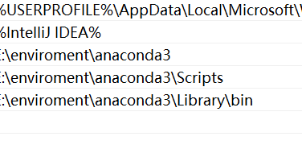
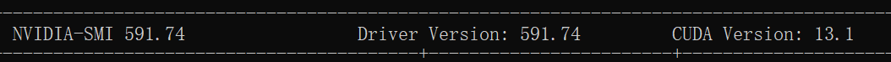

# 一、自然语言处理

## 定义 ：

教会计算机读懂文字听懂语音，并像人一样说出话语完成任务

## 核心任务：

### 自然语言理解 Nature Language Understanding，NLU

* 读懂，输入语言，输出结构化信息
* 从非结构化的文本中提取意义

### 自然语言生成 Natural Language Generation ，NLG

* 输入结构化数据，输出语言
* 比如 天气预测的数据以json存储，转成人类语言 “北京今日晴，气温 25℃，祝您有愉快的一天”

## NLP的技术层次

> ？编译原理

### 词法分析

> * 分词：处理词，将句子切分成词语
> * 词性标注：名词动词等

### 句法分析

> 分析句子语法结构，形成语法树

### 语义分析

> * 词义消歧
> * 关系抽取

### 语用分析

> 在特定语境下理解语言的意图

# 二、NLP的发展历程

略

# 三、NLP的主要任务

| **任务**                           | **是什么**                                                   | **有什么用**                                       | **举例**                                                     |
| ---------------------------------- | ------------------------------------------------------------ | -------------------------------------------------- | ------------------------------------------------------------ |
| **文本分类 (Text Classification)** | 给一段文本自动分配一个或多个预定义的标签                     | 信息组织与过滤；入门最广泛的任务之一               | 情感分析；垃圾邮件过滤；新闻分类                             |
| **命名实体识别 (NER)**             | 从文本中找出并分类关键实体，如人名、地名、组织、时间、产品等 | 将非结构化文本转为结构化信息，是信息抽取的关键一步 | “马云”“1999年”“杭州”“阿里巴巴”等实体识别                     |
| **关系抽取 (Relation Extraction)** | 在识别实体的基础上判断实体间的语义关系                       | 构建知识图谱，深化文本理解                         | 创始人（马云, 阿里巴巴）；创办于（阿里巴巴, 1999年）         |
| **机器翻译 (Machine Translation)** | 自动将一种自然语言翻译成另一种                               | 消除语言隔阂，促进全球交流                         | Attention is all you need → 注意力机制就是你所需要的一切     |
| **文本摘要 (Text Summarization)**  | 将长文本压缩为简短摘要，保留核心信息                         | 快速获取要点，节省阅读时间                         | 新闻摘要；会议纪要                                           |
| **问答系统 (Question Answering)**  | 针对问题给出精准、简洁的答案                                 | 高效信息获取，是智能客服/搜索的核心能力            | “珠穆朗玛峰多高？→ 8848.86米”；“我的订单何时到？→ 预计明天下午 3 点前” |
| **文本生成 (Text Generation)**     | 根据输入（关键词、数据、图片等）自动生成文本                 | 内容创作、人机交互、报告自动化                     | AI 写作；代码生成                                            |
| **对话系统 (Dialogue System)**     | 模拟多轮对话，理解上下文并作出恰当回应                       | 智能助理、情感陪伴、客服等交互式应用               | 连续对话、记忆上下文的应答                                   |

# 四、NLP面临的主要挑战

1. 语言、知识与推理的挑战
2. 技术、数据与伦理的挑战

# 环境准备

1. Anaconda安装：py环境管理
     https://www.anaconda.com/download/success

2. 配置系统用户变量path

    

3. 配置源
    ```
    conda config --add channels https://mirrors.tuna.tsinghua.edu.cn/anaconda/pkgs/main/
    conda config --add channels https://mirrors.tuna.tsinghua.edu.cn/anaconda/pkgs/r/
    conda config --add channels https://mirrors.tuna.tsinghua.edu.cn/anaconda/pkgs/msys2/
    conda config --set show_channel_urls yes
    ```

    

4. 新建环境
    ```
    创建环境
    conda create -n base-llm python=3.10
    激活环境
    conda activate base-llm
    安装第三方库
    pip install numpy pandas matplotlib scikit-learn jupyter
    安装torch
    pip install torch torchvision torchaudio
    
    ```

    

5. GPU

    1.  查看电脑cuda版本，查看tookit对应[CUDA Toolkit 13.2 - Release Notes — Release Notes 13.2 documentation](https://docs.nvidia.com/cuda/cuda-toolkit-release-notes/index.html)
        我这里是
        对应


        安装[CUDA Toolkit 13.1 Update 1 Downloads | NVIDIA Developer](https://developer.nvidia.com/cuda-13-1-1-download-archive)
        安装torch

