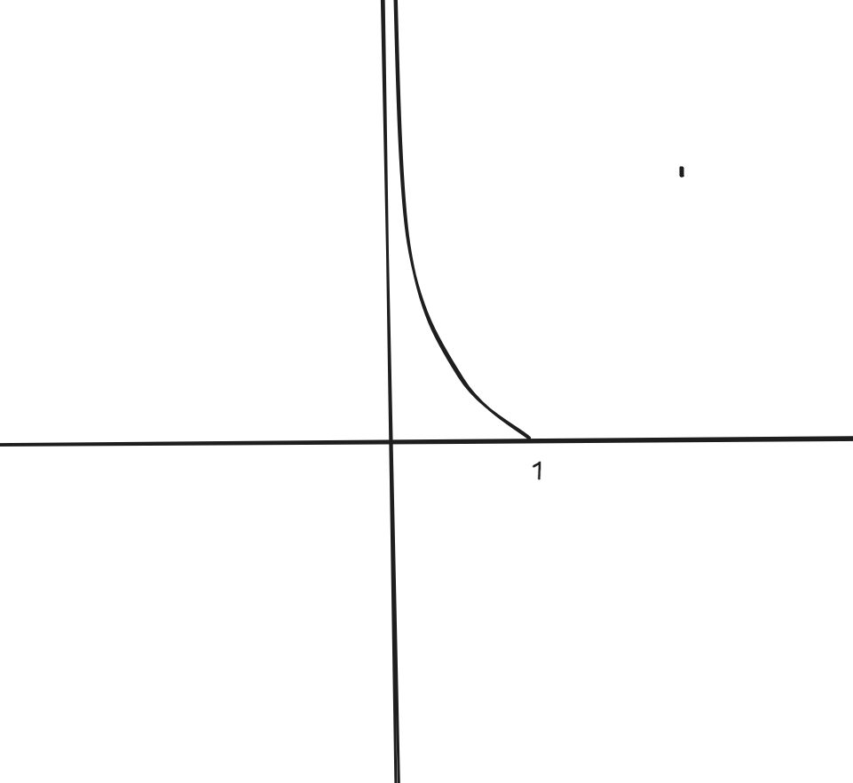
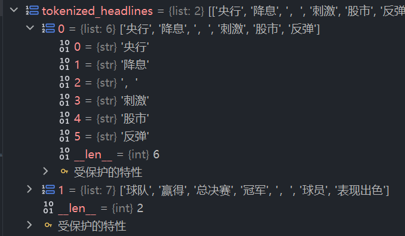
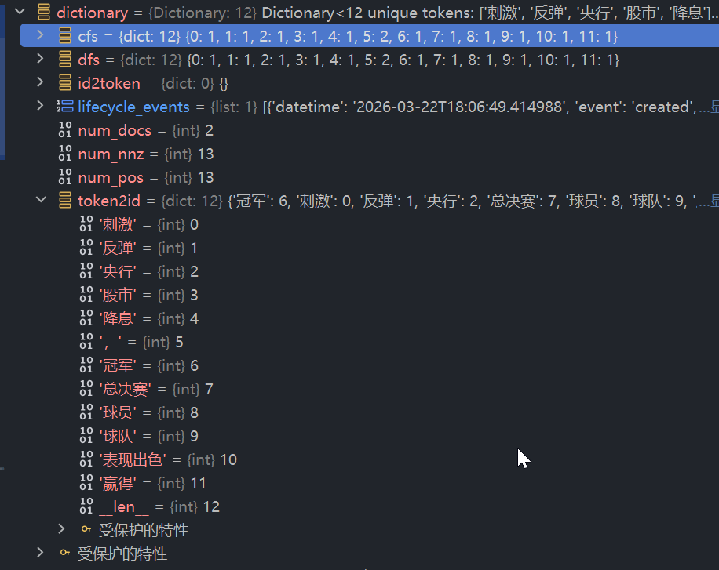
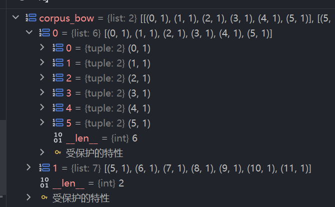

# 初级分词技术

## 一、分词

### 定义

> 把连续的文本序列切分成具有独立语义的基本单元（即“词”或“词元”）

### 重要性

> 后续NLP所有任务的基础

## 二、切分工具 jieba

> 传统语言学分词上的中文分词库

### 安装

```sh
# 安装
pip install jieba
# 验证
pip show jieba
```

### jieba的原理

> 基于规则与词典，核心依赖于一部大辞典和一套匹配规则
>
> 过程：基于一个前缀词典（Trie 树），构建出一个包含句子中所有可能词语组合的有向无环图DAG，并为路径中的每个词设置一个概率，最终找出一条概率最大的路径
> 概率近似
> $$ P(w_1, w_2, ..., w_n) = P(w_1)P(w_2)...P(w_n) $$
>
> 每个词$$w_i$$的概率$$P(w_i)$$可以在词典（语料库）中的频率估算
>
> $P(w_i) = \frac{\text{词 } w_i \text{ 的词频}}{\text{词典中所有词的总词频}}$

#### 1.概率计算过程

大量小于1的概率值相乘会使结果趋近于零导致无法比较，所以jieba采用对数概率技术，将累乘转为累加
寻找概率最大值就等价寻找log概率之和的最大值
$$
\underset{i=1}{\overset{n}{\operatorname{argmax}}} \sum \log P(w_i)
$$

接下来采用**<u>动态规划</u>**，从末尾开始向前递推计算到每个位置的最优切分路径和记录log概率之和

例子：

> 给阿姨倒一杯卡布奇诺

可能会有这样两条候选路径

* 路径 A（给 阿姨 倒 一杯 卡布奇诺）
* 路径 B（给 阿姨 倒 一 杯 卡布奇诺）

其中就是"一杯"区别

那对数概率为 

序列 A (分词方案 1): 给 / 阿姨 / 倒 / 一杯 / 卡布奇诺 $$ \text{Score}_A = \log P(\text{给}) + \log P(\text{阿姨}) + \log P(\text{倒}) + \log P(\text{一杯}) + \log P(\text{卡布奇诺}) $$
序列 B (分词方案 2): 给 / 阿姨 / 倒 / 一 / 杯 / 卡布奇诺 $$ \text{Score}_B = \log P(\text{给}) + \log P(\text{阿姨}) + \log P(\text{倒}) + \log P(\text{一}) + \log P(\text{杯}) + \log P(\text{卡布奇诺}) $$

核心差异与决策
这两个序列的区别在于对“一杯”这个词的处理：
方案 A 将“一杯”视为一个完整的词。
方案 B 将“一杯”切分为“一”和“杯”两个词。
如何判断哪个更好？ 我们需要比较 $\text{Score}_A$ 和 $\text{Score}_B$ 的大小：
如果 $\text{Score}_A > \text{Score}_B$，则模型认为“一杯”作为一个整体出现的概率更高，方案 A 更优。
如果 $\text{Score}_B > \text{Score}_A$，则模型认为分开成“一”和“杯”的概率更高，方案 B 更优。
这通常取决于训练语料库中“一杯”作为固定搭配出现的频率， “一”和“杯”单独出现的频率组合。

#### 2.实践

```python
import jieba

text1 = "我在梦里收到清华大学录取通知书"
seg_list = jieba.lcut(text1, cut_all=False) # cut_all=False 表示精确模式
print(seg_list)
# ['我', '在', '梦里', '收到', '清华大学', '录取', '通知书']
```

如果是词典中没有收录的新词，那么新词就容易被拆分乘更小的片段，这时候就需要人工干预，通过自定义词典将新词加入词表

> 未登录词（OOV, Out-Of-Vocabulary）是一个“相对概念”——相对某个词典/词表未被收录的词。对词典法来说，就是词典里没有。典型表现是本该作为一个整体的词因未被收录而被错误地切碎成单字或无关的片段。

```python
# 自定义词典 user_dict.txt
九头虫
奔波儿灞

# 未加载词典前的错误分词
text = "九头虫让奔波儿灞把唐僧师徒除掉"
print(f"精准模式: {jieba.lcut(text, cut_all=False)}")
# 精准模式: ['九头', '虫', '让', '奔波', '儿', '灞', '把', '唐僧', '师徒', '除掉']

# 加载自定义词典
jieba.load_userdict("./user_dict.txt") 
print(f"加载词典后: {jieba.lcut(text, cut_all=False)}")
# 加载词典后: ['九头虫', '让', '奔波儿灞', '把', '唐僧', '师徒', '除掉']
```

#### 3.精确模式工作流程原理解析

> 最短路径问题

"我在梦中收到清华大学录取通知书"

1. 文本预处理与分块（cut方法）
    将整个句子切分成连续的汉字区块和非汉字区块，汉字部分进入后续的分词流程

2. 构建有向无环图（get_DAG方法）
    扫描句子，找出所有可能的构成路径

    * 路径 A: 0 -> 1 -> 2 -> 3 -> 4 (清/华/大/学)
    * 路径 B: 0 -> 2 -> 3 -> 4 (清华/大/学)
    * 路径 C: 0 -> 2 -> 4 (清华/大学)
    * 路径 D: 0 -> 4 (清华大学) <-- 通常概率最大，被选中

3. 计算最优路径（calc方法）

    > 采用动态规划计算最大概率路径，从句子的末尾向前反向计算，记录在route表中

4. 从路由表中重建结果（__cut_DAG_NO_HMM 方法）

TODO ：后续补充代码实现

### 统计学习时代的方法

> 将分词看做一个序列标注问题，为句子中的每个字打上一个位置标签
>
> 比如 B (Begin) 表示词的开始，M (Middle) 表示词的中间，E (End) 表示词的结束，S (Single) 表示单字成词
>
> 这样 “我爱北京”会被标注为 S S B E，通过这种方式，分词任务就转化为了寻找字序列对应的最合理标签序列的问题。
>
> 由此引出解决此类问题的经典生成式模型--隐马尔可夫模型

#### 1.识别未登录词

* __cut_DAG_NO_HMM 依赖词典，对于OOV直接切碎成单字

* 默认开启的__cut_DAG 方法采用了“单字缓冲，二次加工”的混合策略

    > 将路径识别中遇到的单字都存进缓冲区，直到遇到多字词或句子结束，就调用HMM模型对缓冲区的字符串进行二次分词。

    ```python
    text = "我在Boss直聘找工作"
    
    # 开启HMM（默认）
    seg_list_hmm = jieba.lcut(text, HMM=True)
    print(f"HMM开启: {seg_list_hmm}")
    
    # 关闭HMM
    seg_list_no_hmm = jieba.lcut(text, HMM=False)
    print(f"HMM关闭: {seg_list_no_hmm}")
    
    HMM开启: ['我', '在', 'Boss', '直聘', '找', '工作']
    HMM关闭: ['我', '在', 'Boss', '直', '聘', '找', '工作']
    ```

####2.词性标注

> jieba采用词典查询和隐马尔科夫模型相结合的混合策略，识别每个词语的语法属性（名词、动词、形容词等）
>
> 先前那个初始词典未提供词性，jieba会给他一个默认的不一定准确的词性

```python
import jieba.posseg as pseg

text = "九头虫让奔波儿灞把唐僧师徒除掉"

# HMM=False 强制只使用词典和动态规划
words = pseg.lcut(text, HMM=False)
print(f"默认词性输出: {words}")

# 默认词性输出: [pair('九头虫', 'x'), pair('让', 'v'), pair('奔波儿灞', 'x'), pair('把', 'p'), pair('唐僧', 'nr'), pair('师徒', 'n'), pair('除掉', 'v')]
```

尝试调整词频干预分词

```
九 10000000 n
头 1000000 n
奔波儿灞 nr

```

```python
# 重新加载词典
jieba.load_userdict("./user_pos_dict.txt")

dic_words = pseg.lcut(text, HMM=False)
print(f"加载词性词典后: {dic_words}")
# 加载词性词典后: [pair('九', 'n'), pair('头', 'n'), pair('虫', 'n'), pair('让', 'v'), pair('奔波儿灞', 'nr'), pair('把', 'p'), pair('唐僧', 'nr'), pair('师徒', 'n'), pair('除掉', 'v')]
```

常见词性标签含义

| 标签 | 含义     | 标签 | 含义     |
| ---- | -------- | ---- | -------- |
| n    | 名词     | nr   | 人名     |
| ns   | 地名     | nt   | 机构团体 |
| nz   | 其他专名 | V    | 动词     |
| a    | 形容词   | d    | 副词     |
| m    | 数词     | q    | 量词     |
| r    | 代词     | p    | 介词     |
| C    | 连词     | u    | 助词     |
| t    | 时间词   | X    | 非语素字 |
| W    | 标点符号 | un   | 未知词   |

### 从分词到分块

> 现代NLP模型更倾向于采用“无分词”或“弱分词”的策略，将文本处理成更基础的、数据驱动的单元
>
> 主要分为子粒度和词粒度两种

#### 1.字粒度分词

以BERT为代表，处理中文时，直接将汉字视为一个独立token

#### 2.子词分词

以GPT为代表的大语言模型，采用更灵活的子词（Subword）切分方案，主流算法为BPE（BytePair Encoding)

后续了解

# 词向量表示

## 一、词向量背景

* 模型无法直接理解文本数据
* 弥合自然语言（符号世界）与数学模型（向量空间）的鸿沟
* 需要系统性的方法，将分词后的词元序列（如 ["国足", "爱", "吃", "海参"]）整体转换为模型能够处理的一个或一组有意义的数字。

> 将符号转换为数字的过程->词向量表示
>
> 唯一地标识每一个词，理想情况下向量本身能够蕴含词语的语义信息

* 让计算机更深入的理解词语之间的语义关系，是NLP领域追求的重要方向

## 二、离散表示

> 深度学习之前，将词语表示为固定向量的方法
>
> 将每个词视为一个独立的、不可再生的单元，所有生成的向量被称为离散向量
>
> 特点是维度高且稀疏

### 1.独热编码 （One-Hot Encoding）

#### 原理

> 又称“哑编码”
>
> 最直观、基础的词元级别表示方法
>
> 将每个词元都看做一个独立的类别

步骤：

1. 先构建词典：从整个语料库中收集所有出现过的唯一词语构成词典
2. 分配索引：为词典中每个词语分配一个从0开始的唯一整数索引
3. 创建向量：用一个长度等于词典大小的向量来表示每个词，向量中改词对应索引的位置为1，其余全为0

例如 ["我", "先", "挣", "它", "一个", "亿"]

```
"我"   -> [1, 0, 0, 0, 0, 0]
"先"   -> [0, 1, 0, 0, 0, 0]
"挣"   -> [0, 0, 1, 0, 0, 0]
"它"   -> [0, 0, 0, 1, 0, 0]
"一个" -> [0, 0, 0, 0, 1, 0]
"亿"   -> [0, 0, 0, 0, 0, 1]
```

#### 优缺点

优点：实现简单

缺点：

* 维度过大
* 语义鸿沟：不同词的独热向量都是正交，相互垂直，意味着同等的不相似，无法从向量层面得知词与词之间的任何相似关系

### 2.词袋模型 （Bag-of-Words,BoW）

> 为解决哑编码仅表示单个词的问题诞生，表示整个句子或文档
>
> 是文档级别特征最常用的方法之一

#### 基本思想与实现

> 忽略文本中的词序和语法，将其仅仅视作一个装满词的袋子，用袋子中每个词出现的统计量来表示整个文档
>
> 将文档中所有词的独热向量相加得到最终向量
>
> 最终向量维度等于词典大小，每一维的值代表对应词语在文档中出现频次
>
> 实际实现通常直接统计每个词的出现次数

例如 现有两个文档，其中文档 1 的内容为 我 先 挣 一个 亿，文档 2 的内容为 我 挣 它 一个 亿。那么它们的词袋表示就是：

```java
vec(文档1) = vec(我) + vec(先) + vec(挣) + vec(一个) + vec(亿) = [1, 1, 1, 0, 1, 1]
vec(文档2) = vec(我) + vec(挣) + vec(它) + vec(一个) + vec(亿) = [1, 0, 1, 1, 1, 1]
```

可以通过最终向量看出两个文档是比较相似的

#### 余弦相似度计算

> 余弦相似度（Cosine Similarity）：通过计算两个向量夹角的余弦值来衡量他们的相似性
>
> 对于非负向量（如词袋模型产生的向量），其值在 【0，1】之间，值越接近1，两个向量越靠近，就越相似

公式：$\cos(\theta) = \frac{\mathbf{A} \cdot \mathbf{B}}{\|\mathbf{A}\| \|\mathbf{B}\|} = \frac{\sum_{i=1}^{n} A_i B_i}{\sqrt{\sum_{i=1}^{n} A_i^2} \cdot \sqrt{\sum_{i=1}^{n} B_i^2}}$

对于上文中的文档向量，令 A = vec(文档1) = [1, 1, 1, 0, 1, 1]，B = vec(文档2) = [1, 0, 1, 1, 1, 1]

* 点积：A·B:(1×1)+(1×0)+(1×1)+(0×1)+(1×1)+(1×1)=1+0+1+0+1+1=4
* 模长：
    $[
    \|\mathbf{A}\| = \sqrt{1^2 + 1^2 + 1^2 + 0^2 + 1^2 + 1^2} = \sqrt{5}, \quad
    \|\mathbf{B}\| = \sqrt{1^2 + 0^2 + 1^2 + 1^2 + 1^2 + 1^2} = \sqrt{5}
    \]$

* 计算相似度：
    $
    \cos(\theta) = \frac{4}{\sqrt{5} \cdot \sqrt{5}} = \frac{4}{5} = 0.8
    $

* 非常接近1，高度相似

#### 不同统计方式

* 对于每一维的值可以采用不同策略
    * 使用频数：单词在文中出现次数，长文章的计数偏高
    * 使用频率：单词次数除以文档总词数
    * 二进制：出现为1，否则为0

词袋模型实现简单在文本分类等任务上表现不错，

但丢失词序无法区分语义差异，未考虑词的重要性，例如一些词“的”“等”之类的，会对文档主题进行干扰

### 3.TF-IDF

> 提升文档在向量空间中的区分度，解决“常见词权重过高”导致文档混淆的问题
>
> TF-IDF（Term Frequency-Inverse Document Frequency），加权技术
>
> TF-IDF 的理念是一个词的重要性与其在当前文档中出现的次数成正比，而与其在整个语料库中出现的频率成反比。换言之，一个词在当前文档里越常见，但在其他文档里越罕见，它的权重就越高

#### 算法组成

* 词频（Term Frequency，TF）：衡量词在当前文档中出现的频繁程度

     两种计算方式
    * 使用原始频数 ${TF}(t,d) = f_{t,d}$（f表示词t在文档d中出现的次数
     * 使用归一化频率 ${TF}(t,d) = \frac{f_{t,d}}{\displaystyle\sum_{t' \in d} f_{t',d}}
         $，通过除以文档总次数来消除长文档带来的偏差
    
 * 逆文档频率（Inverse Document Frequent，IDF）：衡量一个词的稀有程度或信息量，由由 Karen Sparck Jones 在 1972 年提出 2，其定义如下：
     ${IDF}(t, D) = \log \left( \frac{|D|}{|\{d \in D : t \in d\}|} \right)$，其中|D| 是语料库中的总文档数
     ${|\{d \in D : t \in d\}|}$是包含词t的文档数，log中越大越稀有
     为避免除零错误使用平滑版本：${IDF}(t, D) = \log \left( \frac{|D|}{1+|\{d \in D : t \in d\}|} \right)$

最终一个词的TF-IDF向量就是该文档中每个词的TF-IDF值构成的向量

#### 实际应用

* 关键词提取，计算文章中每个词的TF-IDF值并降序排列，最前面的就是关键词，jieba中也内置了
* 文本相似度计算，构建两篇文档的TF-IDF向量并计算余弦相似度来判断内容是否相近

### 4.N-gram 模型

> N-gram（N元语法）通过统计连续词组的方式保留文档词序信息
>
> 最早引入预测下一个词的思想

#### 预测下一个词

>  N-gram（1-gram 是特例）关心的是“词的顺序”
>
> 核心基于马尔可夫假设，认为一个词出现的概率只取决于它前面N-1个词
>
> 多种类型
>
> *  Unigram（1-gram） 和词袋模型一样，假设每个词独立且不依赖前文；
> * Bigram（2-gram） 只依赖前 1 个词，例如看到“喜欢”预测“玩”的概率； 
> * Trigram（3-gram） 则依赖前 2 个词，例如根据“喜欢 玩”来预测“GTA6”的概率
> * 超级N-gram模型：像GPT，N非常大，根据上文预测下一个词

例  “我喜欢玩 GTA6”

Bigram 特征 是 {"我 喜欢", "喜欢 玩", "玩 GTA6"}

Trigram 特征 则是 {"我 喜欢 玩", "喜欢 玩 GTA6"}

这样模型就能区分 "我 喜欢" 和 "喜欢 我" 了，而词袋模型则认为两句话是一样的

#### 计算

1. 核心步骤：统计频率

    > 使用一个长为N的滑动窗口在文本上移动，统计每个窗口内词序出现的次数

    例如 "我 爱 自然 语言 处理"

    ```java
    例如：计算 Bigram (N=2)
    滑动窗口：每次取连续 2 个词。
    [我, 爱]
    [爱, 自然]
    [自然, 语言]
    [语言, 处理]
    计数结果：
    (我, 爱): 1 次
    (爱, 自然): 1 次
    (自然, 语言): 1 次
    (语言, 处理): 1 次
    
    例如：计算 Trigram (N=3)
    滑动窗口：每次取连续 3 个词。
    [我, 爱, 自然]
    [爱, 自然, 语言]
    [自然, 语言, 处理]
    计数结果：
    (我, 爱, 自然): 1 次
    (爱, 自然, 语言): 1 次
    (自然, 语言, 处理): 1 次
    ```

2. 广义计算公式
    将文本看成一个词序列 $w_1,w_2,w_3,w_4,...w_n$

    * Unigram（1-gram）：词本身，计数 $C(w_i)$
    * Bigram（2-gram）：连续两个词，计数$C(w_{i-1},w_i)$
    * Trigram（3-gram）：连续三个词，计数$C(w_{i-2},w_{i-1},w_i)$

    数量计算：在一个长度为n的句子中

    * Unigram的数量 = n
    * Bigram的数量 = n - 1
    * Trigram的数量 = n - 2

3. N-gram在语言模型中的应用：概率计算

    > N-gram最核心的应用是计算一个句子出现的频率
    > 这里用条件概率的链式法则加上马尔可夫假设（即当前词只跟前面N-1个词有关

    * Bigram 模型（N = 2），当前词只与前面一个词有关
        公式 $P(w_i \mid w_{i-1}) = \frac{C(w_{i-1}, w_i)}{C(w_{i-1})}$
        分子 ：统计$(w_{i-1},w_i)$这个Bigram出现的次数
        分母：统计$w_{i-1}$这个词出现的总次数
        计算整句的概率：$P(\text{我 爱 自然}) = P(\text{我}) \times P(\text{爱} \mid \text{我}) \times P(\text{自然} \mid \text{爱})$

总结：

N-gram 的计算 = 滑动窗口统计 + 除法求概率。

训练阶段：遍历文本，数出所有长度为 N 的片段出现的次数。

推理阶段：用这些统计次数，通过除法公式计算给定上文，下一个词出现的概率。

#### 挑战

N-gram找回了语序，但需要巨大代价

* 指数爆炸，1000个词，Bigram需要$10^8$种组合，Trigram需要$10^{12}$种（这里都是可能性的上限）
* 数据稀疏，大多数组合在预料种永远不会出现，导致概率为0

后续为解决这个问题，传统NLP发展出了复杂的平滑技术以及通过将词聚类来减少参数的“基于类的N-gram模型”

## 三、序号化表示

> 在深度学习时代，只进行最少的预处理，把文本转换成最基础的整数ID序列，然后把学习词语的含义和重要性的这个更复杂的任务交给模型自己去完成

#### 1.序号化过程

> 序号化（整数编码）：将分词后的词元序列转换为深度学习模型能够处理的整数序列的核心步骤

1. 构建词典
    从训练预料中构建一个词典，在深度学习中通常是字级别（如BERT）或是子词级别（如GPT），而不是词级别
    
2. 构建特殊词元：在词典中加入一些有特殊功能的 Token，至少包括 [PAD]（Padding）和 [UNK]（Unknown）。[PAD] 的 ID 通常为 0，用于将短句子填充至同一批次内的最长长度，以满足批处理需求；[UNK] 的 ID 通常为 1，用于表示所有词典中未出现过的词。根据任务需求，还可能加入 [CLS]（分类）、[SEP]（分隔）等其他特殊词元。
3. ID 映射：将文本中的每个词元（字/子词）直接映射为其在词典中的整数ID

> 在实践中，很少从零开始为自己的小数据集构建词典。更常见的做法是，**<u>直接使用像 BERT、GPT 这类预训练模型官方提供的词典文件（vocab.txt）</u>**。这些词典通常包含了数万个字、子词、符号等，是在海量通用语料上构建的，覆盖面非常广。例如，Google 的中文 BERT 模型词典 vocab.txt 中就包含了约 21128 个词元，其中不仅有常用汉字，还包括了英文字母、数字、标点及 [PAD]/[UNK] 等特殊符号。

#### 2.序号化实例

例如对三个句子进行处理 

“我挣一个亿”、“比方说我”和“我先挣钱”

精简词典

```
{'[PAD]': 0, '[UNK]': 1, '比': 2, '方': 3, '说': 4, '我': 5, '先': 6, '挣': 7, '它': 8, '一': 9, '个': 10, '亿': 11}
```

首先分词，并查找词元对应ID

```
句子1 (我挣一个亿): 我 (5), 挣 (7), 一 (9), 个 (10), 亿 (11) -> [5, 7, 9, 10, 11]
句子2 (比方说我): 比 (2), 方 (3), 说 (4), 我 (5) -> [2, 3, 4, 5]
句子3 (我先挣钱): 我 (5), 先 (6), 挣 (7), 钱 (不在词典中) -> [5, 6, 7, 1]
```

组成矩阵，以最长的序列为基准，使用[PAD]来对其他序列进行填充

```
序列1 (长度5): [5, 7, 9, 10, 11]
序列2 (长度4→5): [2, 3, 4, 5, 0]
序列3 (长度4→5): [5, 6, 7, 1, 0]
```

最后得到3x5的整数矩阵，这个就是给深度学习模型的最终输入

```
# 最终输入模型的张量（Tensor）
[[5, 7, 9, 10, 11],
 [2, 3, 4, 5,  0],
 [5, 6, 7, 1,  0]]
```

> 序号化本身并未解决语义鸿沟，其整数ID（如 2 和 3）不具备数学意义，它真正价值是作为后续嵌入层的输入。嵌入层会将这些ID查询并映射为低维、稠密的浮点数向量（即词向量），而这个映射关系本身是在模型训练中学习出来的

# 从主题模型到Word2Vec

## 一、寻找理想的词向量

> 哑编码和序号化无法表达词与词之间的语义关系

### 分布式表示（Distributed Representation）

> 将词语映射到一个低纬稠密且蕴含丰富语义信息的连续向量空间中

### 理想词向量

* 语义蕴含：向量之间的距离能够度量词语之间的语义相似度
    如果两个词经常在相似的上下文中共同出现，那么他们的向量在空间上应该是彼此靠近的
* 低纬稠密：摆脱维度灾难，向量中的每一维都应是有意义的浮点数，而非绝大部分0的稀疏表示

为实现这一目标探索了以下的技术路径

### 不同技术路径

* 基于全局文档统计的主题模型：利用全局统计初步实现语义捕捉，而后的Word2Vec则通过全新的局部预测范式，释放了分布式表示的强大威力
* 基于局部上下文预测的神经网络模型

## 二、主题模型

> 基于机器学习和传统数学思想的经典方法
>
> 尝试从宏观视角，通过分析大量文档的词语共现统计，来发现词语间的潜在语义关联
>
> 关键假设：一篇文档由多个“主题”按一定比例混合而成，而一个主题又由多个“词语”按一定概率组成
>
> 例如，一篇关于"人工智能"的文档，会高频出现"深度学习"、"Transformer"、"注意力机制"等词。正是因为这些词都强关联于“AI技术”这个主题，它们才频繁地共现在一起。所以，一个词的向量，就可以用它与各个主题的关联强度来表示。而这其中最核心的技术就是<u>**矩阵分解（Matrix Factorization）**</u>。

### 1.SVD矩阵分解

步骤

#### 构建“词-文档”矩阵

> 以整个语料库为基础，构建一个巨大的词-文档矩阵X
>
> 该矩阵每一行代表一个词，每一列代表一篇文档
>
> 矩阵中$X(i,j)$的值词i在文档j中的重要性权重，可以使用TF-IDF值来填充
>
> 这个矩阵通常是巨大且高度稀疏

#### 矩阵分解

> 在线性代数的角度看，这个巨大的稀疏矩阵X可以被近似的分解为两个更小的更稠密的矩阵的乘积
>
> 最常用的分解技术之一是奇异值分解（SVD）$X_{m \times n} \approx W_{m \times k} \times H_{k \times n}$

* $X_{m \times n}$是原始的词-文档矩阵，$m$是词典大小，$n$是文档数量
* $k$是一个远小于$m$和$n$的超参数，代表期望发现的潜在主题数量
* $W_{topic}$表示“词-主题矩阵”：每一行都是一个k维稠密向量，表示一个词语k个主题的关联度
* $H_{topic}$表示文档-主题矩阵：每一列都是一个k维的稠密向量，表示一篇文档在k个主题上的分布

#### 获取词向量

我们需要的是词-主题矩阵$W_{topic}$这个矩阵的每一行，这就是我们需要的词向量

它将原来m维的One-Hot编码降维到了k维，还是个稠密向量，每个维度都代表了与某个主题的关联强度

这个矩阵蕴含语义信息

例如如果两个词（如"CPU"和"GPU"）经常在描述"硬件"这个主题的文档中共同出现，那么SVD分解的结果会使它们在对应"硬件"主题的那个维度上都有很高的值，从而使它们的最终词向量在空间上非常接近

示例：

### 2.主题模型的局限性

> 本质是聚类算法
>
> 文档主题矩阵$H_{topic}$将n篇文档聚成k个主题类别，每篇文档都有个k维向量，表示它属于各个主题的置信度或软分配

例如，一篇文档可能 70% 属于“AI技术”主题，30% 属于“数学理论”主题。同时，单词主题矩阵$W_{topic}$揭示了词语的主题倾向，有些词语（如“深度学习”、“Transformer”）更倾向于描述“AI 技术”主题，而另一些词语（如“坦克”、“导弹”）则更倾向于描述“军事”主题。

这在一定程度上减弱了“同义词”问题，虽然“番茄”和“西红柿”写法完全不同，但因为它们都高频出现在“烹饪”或“蔬菜”相关的主题中，它们在$W_{topic}$揭矩阵中的向量表示就会非常相似。

正因为描述同一主题的词语会在相同的主题维度上有较高的权重，它们的词向量才会在空间中彼此靠近，从而实现语义信息的捕捉。

尽管主题模型（如其更广为人知的名字 LSA, Latent Semantic Analysis 1）通过对全局的"词-文档"共现矩阵进行分解，成功地将词语映射到了一个低维的"主题空间"，得到了能够表达语义的稠密词向量，但它也存在明显的局限性。

比如对一个大型语料库进行 SVD 分解，计算量和内存开销都极大，导致计算代价高昂；其次，它依赖的是<u>**全局的、粗粒度**</u>的文档级别共现信息，忽略了词语在句子中的**<u>局部上下文和词序信息</u>**，使得它难以捕捉更精细的语义关系；而且这种“先统计，再分解”的流程，很难与现代的深度学习模型进行端到端的联合训练，难以集成。

## 三、Word2Vec

> 将视角聚焦于词语的局部上下文
>
> 语言学中的分布式假设：一个词的含义由其上下文中的词语所决定
>
> 也就是，两个词的上下文经常是相似的，那两个词的语义就是相近的

### 1.概述

> 被认为是一种浅层神经网络模型（Shallow Neural Network）
>
> 浅层：网络结构简单，移除了传统神经概率语言模型（NNLM）中计算昂贵的非线性隐藏层，直接将投影层于输出层相连
>
> 最终目标是获取一个高质量的词向量查询表：
>
> ​	一个巨大的矩阵$W_{in}$，其中每一行都是对应单词的稠密向量
>
> 获取方法——巧妙的“伪任务”：根据上下文预测中心词（或反之），在此过程中将词向量查询表作为模型参数进行训练和优化。
>
> 训练结束后，执行预测任务的神经网络本身会被丢弃，我们真正保留和使用的，只有作为其内部参数的那个词向量查询表

### 2.可学习的词向量矩阵

#### 将单词的ID转为稠密向量的过程

1. 输入代表单词的ID（如3）
2. 进行哑编码，将ID转为一个维度等于词典大小$|V|$的高维稀疏向量【0,0,0,1,...】只有第三个位子为1
3. 进行矩阵乘法：用这个One-Hot向量去乘以一个巨大的可学习的参数矩阵$W_{in}$（尺寸为$|V|\text{x}|D|$,该矩阵为最终的词向量查询表

在实践中，为了极大地提升效率，程序并不会真的执行稀疏的矩阵乘法，而是直接实现一个查询操作：根据输入的单词D,直接从$W_{in}$矩阵中获取对应的行向量。理解这里的关键在于，这个参数矩阵$W_{in}$本身就是学习的目标。它被随机初始化，并在后续的训练过程中，通过CBOW或Skip-gram这样的预测任务不断地被优化和调整。

> 以 PyTorch 为例，它的 nn.Embedding 层本质上就是维护了这个$W_{in}$矩阵（词向量查找表）。当我们在后续章节中搭建模型时，第一层通常都是 Embedding 层。它接收输入序列的整数 ID，直接通过查表将其映射为稠密的词向量，而这个矩阵的参数会随着整个模型的训练（反向传播）而被自动更新和学习。
>

### 3.模型架构与实现原理

#### 两种经典模型

> Word2Vec包含CBOW和Skip-gram两种具体的实现模型
>
> 两者在任务设计上恰好相反
>
> 目标相同，通过训练过程得到一个高质量的词向量查询表

*  CBOW模型（Continuous Bag-of-Words）

    > 根据上下文预测中心词
    >
    > 输入和输出矩阵刚开始都是随机生成的

    步骤+例子（批处理样板两个，窗口S=6，词典大小$|V|$ = 10000,每个值是一个词的 ID（0 到 9999），词向量维度 D = 128）

    1. 词向量转换：对于每个词$w_{c-k}$，从输入矩阵$W_{in}$中获取对应的词向量$v_{c-k} = W_{in}w_{c-k}$。
        ```
        样本1: [我(15), 喜欢(28), 自然(42), 语言(37), 处理(51), 模型(89)]
        样本2: [机器(23), 学习(56), 是(12), 重要(99), 领域(71), 之一(44)]
        
        查表用词ID取出对应行
        输入 （2,6） = （2,6,128）
        ━━━━━━━━━━━━━━━━━━━━━━━━━━━━━━━━━━━━━━━━━━━━━━━━━━━━━━━━━━━━━━━━
        第一步：输入层
        ━━━━━━━━━━━━━━━━━━━━━━━━━━━━━━━━━━━━━━━━━━━━━━━━━━━━━━━━━━━━━━━━
        形状: (2, 6)
        ┌─────────────────────────────────────┐
        │ 样本1: [15, 28, 42, 37, 51, 89]     │  ← 6个词ID
        │ 样本2: [23, 56, 12, 99, 71, 44]     │  ← 6个词ID
        └─────────────────────────────────────┘
                 ↓
            词 ID 整数
        ━━━━━━━━━━━━━━━━━━━━━━━━━━━━━━━━━━━━━━━━━━━━━━━━━━━━━━━━━━━━━━━━
        第二步：查表 (W_in: 10000 × 128)
        ━━━━━━━━━━━━━━━━━━━━━━━━━━━━━━━━━━━━━━━━━━━━━━━━━━━━━━━━━━━━━━━━
        形状: (2, 6, 128)
        样本1:
        ┌────────────────────────────────────────────────────────────────┐
        │ 词15 → [0.12, -0.23, 0.45, ..., 0.67]  (128个数字)           │
        │ 词28 → [0.34, 0.56, -0.12, ..., 0.23]  (128个数字)           │
        │ 词42 → [0.67, -0.08, 0.33, ..., -0.45] (128个数字)           │
        │ 词37 → [-0.45, 0.21, -0.67, ..., 0.12] (128个数字)           │
        │ 词51 → [0.23, -0.54, 0.78, ..., 0.34]  (128个数字)           │
        │ 词89 → [0.56, 0.12, -0.23, ..., 0.78]  (128个数字)           │
        └────────────────────────────────────────────────────────────────┘
        样本2:
        ┌────────────────────────────────────────────────────────────────┐
        │ 词23 → [0.45, -0.12, 0.23, ..., 0.56]  (128个数字)           │
        │ 词56 → [-0.34, 0.67, 0.12, ..., -0.23] (128个数字)           │
        │ 词12 → [0.78, 0.23, -0.45, ..., 0.34]  (128个数字)           │
        │ 词99 → [-0.12, 0.45, 0.67, ..., -0.56] (128个数字)           │
        │ 词71 → [0.34, -0.67, 0.23, ..., 0.45]  (128个数字)           │
        │ 词44 → [0.67, 0.34, -0.12, ..., 0.23]  (128个数字)           │
        └────────────────────────────────────────────────────────────────┘
                 ↓
            每个词ID变成一个128维向量
        ```
    
        
    
    2. 计算上下文向量，将上下文窗口所有词的词向量聚合（通常求和或平均）
        得到$h = \frac{1}{S} \sum (v_{c-m} + \cdots + v_{c+m})$（以平均为例）
    
        ```
        ━━━━━━━━━━━━━━━━━━━━━━━━━━━━━━━━━━━━━━━━━━━━━━━━━━━━━━━━━━━━━━━━
        第三步：上下文聚合（求平均）
        ━━━━━━━━━━━━━━━━━━━━━━━━━━━━━━━━━━━━━━━━━━━━━━━━━━━━━━━━━━━━━━━━
        
        形状: (2, 128)
        
        对每个样本的6个向量求平均：
        
        样本1: 
          (v15 + v28 + v42 + v37 + v51 + v89) ÷ 6 = h1 (128维)
        
        样本2:
          (v23 + v56 + v12 + v99 + v71 + v44) ÷ 6 = h2 (128维)
        
        ┌─────────────────────────────────────────────────────────────────┐
        │ 样本1 h1: [0.41, -0.16, 0.22, ..., 0.31]  (128个数字)         │
        │ 样本2 h2: [0.29, 0.15, 0.18, ..., 0.42]   (128个数字)         │
        └─────────────────────────────────────────────────────────────────┘
                 ↓
            6个向量压缩成1个平均向量
        ```
        
        
        
    3. 计算输出得分：
        将上下文向量与输出矩阵$W_{out}$相乘得到$z_c = W^T_{out}h$
    
        ```
        ━━━━━━━━━━━━━━━━━━━━━━━━━━━━━━━━━━━━━━━━━━━━━━━━━━━━━━━━━━━━━━━━
        第四步：输出得分（乘以 W_out: 128 × 10000）
        ━━━━━━━━━━━━━━━━━━━━━━━━━━━━━━━━━━━━━━━━━━━━━━━━━━━━━━━━━━━━━━━━
        
        形状: (2, 10000)
        
        样本1: h1 (1×128) × W_out (128×10000) = scores1 (1×10000)
        样本2: h2 (1×128) × W_out (128×10000) = scores2 (1×10000)
        
        ┌─────────────────────────────────────────────────────────────────┐
        │ 样本1 scores: [2.3, 1.8, 5.6, ..., 3.2]  (10000个分数)        │
        │ 样本2 scores: [1.2, 4.5, 2.1, ..., 0.9]  (10000个分数)        │
        └─────────────────────────────────────────────────────────────────┘
                 ↓
            每个样本得到所有10000个词的分数
        ```
        
        
        
    4. 定义损失函数，模型的优化目标是最小化负对数似然：
        $\begin{aligned}
        \text{minimize } J &= -\log P(w_c \mid w_{c-m}, \ldots, w_{c-1}, w_{c+1}, \ldots, w_{c+m}) \\
        &= -\log P(\mathbf{u}_c \mid \mathbf{h}) \\ &softmax 原始分数转为概率分布\\
        &= -\log \frac{\exp(\mathbf{u}_c^T \mathbf{h})}{\sum_{j=1}^{|V|} \exp(\mathbf{u}_j^T \mathbf{h})} \\
        &= -\mathbf{u}_c^T \mathbf{h} + \log \sum_{j=1}^{|V|} \exp(\mathbf{u}_j^T \mathbf{h})
        \end{aligned}$
    
        $u_c$是目标中心词的输出向量
    
        $h$ 是上下文向量
        
        ```
        ━━━━━━━━━━━━━━━━━━━━━━━━━━━━━━━━━━━━━━━━━━━━━━━━━━━━━━━━━━━━━━━━
        第五步：Softmax + 交叉熵损失
        ━━━━━━━━━━━━━━━━━━━━━━━━━━━━━━━━━━━━━━━━━━━━━━━━━━━━━━━━━━━━━━━━
        
        Softmax: 把分数转成概率
        
        样本1: [p1, p2, p3, ..., p10000]  总和=1
        样本2: [p1, p2, p3, ..., p10000]  总和=1
        
        取出正确中心词的概率，计算交叉熵损失：
        
        J = -log P(正确中心词)
        
                 ↓
            反向传播更新 W_in 和 W_out
        ```
        
        
        
        
    
    ```
    输入层                隐藏层              输出层
    (上下文词)           (平均向量)          (预测中心词)
    
    v_我      ──┐
    v_喜欢    ──┤
    v_语言    ──┼──→ h = 平均  ──→ [W']  ──→ softmax ──→ P(自然|上下文)
    v_处理    ──┘
       ↑                    ↑                ↑
    输入矩阵W           隐藏层          输出矩阵W'
    (训练参数)          (中间结果)       (训练参数)
    ```
    
* Skip-gram 模型 

    > 根据中心词预测上下文
    >
    > 具体实现上将一个预测任务分解成多个独立的子任务

    与N-gram的关系

    > 名字渊源：Skip-gram 这个名字确实源于传统的 k-skip-n-gram 模型（允许跳过中间词的 N-gram）。
    > 核心区别：虽然借用了“跳跃”的思想，但 Word2Vec 的 Skip-gram 是一种预测模型，而非统计模型。它并不是为了“修复”N-gram，而是为了更高效地学习稠密词向量。它通过“用中心词预测上下文”这一任务，强迫模型学习到词语的语义特征，从而彻底解决了传统 N-gram 面临的稀疏性和维度灾难问题。

    式子
    $\begin{aligned}
    \text{minimize J} &= -\log P(w_{c-m}, \ldots, w_{c-1}, w_{c+1}, \ldots, w_{c+m} \mid w_c) \\
    &= -\log \prod_{\substack{j=0 \\ j \neq m}}^{2m} P(w_{c-m+j} \mid w_c) \\&= -\log \prod_{\substack{j=0 \\ j \neq m}}^{2m} P(u_{c-m+j} \mid v_c) \\
    &= -\log \prod_{\substack{j=0 \\ j \neq m}}^{2m} \frac{\exp(\mathbf{u}_{c-m+j}^\top \mathbf{v}_c)}{\sum_{k=1}^{|V|} \exp(\mathbf{u}_k^\top \mathbf{v}_c)} \\
    &= -\sum_{\substack{j=0 \\ j \neq m}}^{2m} \mathbf{u}_{c-m+j}^\top \mathbf{v}_c + 2m \log \sum_{k=1}^{|V|} \exp(\mathbf{u}_k^\top \mathbf{v}_c)
    \end{aligned}$
    其中

    $\begin{align*}
    w_c &: \text{中心词} \\
    \mathbf{v}_c &: \text{中心词的输入向量} \\
    \mathbf{u}_{c-m+j} &: \text{上下文词的输出向量} \\
    \mathbf{u}_k &: \text{输出矩阵中第 } k \text{ 个词的输出向量} \\
    |V| &: \text{词汇表大小} \\
    m &: \text{窗口大小（左右各 } m \text{ 个词）} \\
    2m &: \text{上下文词总数}
    \end{align*}$

    ```
    ━━━━━━━━━━━━━━━━━━━━━━━━━━━━━━━━━━━━━━━━━━━━━━━━━━━━━━━━━━━━━━━━━━━━━
    第一步：输入层
    ━━━━━━━━━━━━━━━━━━━━━━━━━━━━━━━━━━━━━━━━━━━━━━━━━━━━━━━━━━━━━━━━━━━━━
    
    形状: (2, 1)
    
    ┌─────────────────────────────┐
    │ 样本1: [42]                  │  ← 中心词ID（如"自然"）
    │ 样本2: [56]                  │  ← 中心词ID（如"学习"）
    └─────────────────────────────┘
             ↓
        每个样本1个中心词ID
    ━━━━━━━━━━━━━━━━━━━━━━━━━━━━━━━━━━━━━━━━━━━━━━━━━━━━━━━━━━━━━━━━━━━━━
    第二步：词向量转换（查表 W_in）
    ━━━━━━━━━━━━━━━━━━━━━━━━━━━━━━━━━━━━━━━━━━━━━━━━━━━━━━━━━━━━━━━━━━━━━
    形状: (2, 1, 128)
    样本1: 中心词ID=42 → v_42 (128维)
    样本2: 中心词ID=56 → v_56 (128维)
    ┌─────────────────────────────────────────────────────────────────────┐
    │ 样本1 v_c: [0.67, -0.08, 0.33, ..., 0.12]  (128个数字)             │
    │ 样本2 v_c: [-0.34, 0.67, 0.12, ..., 0.45]  (128个数字)             │
    └─────────────────────────────────────────────────────────────────────┘
             ↓
        每个中心词ID变成128维向量
    ━━━━━━━━━━━━━━━━━━━━━━━━━━━━━━━━━━━━━━━━━━━━━━━━━━━━━━━━━━━━━━━━━━━━━
    第三步：输出得分（乘以 W_out: 128 × 10000）
    ━━━━━━━━━━━━━━━━━━━━━━━━━━━━━━━━━━━━━━━━━━━━━━━━━━━━━━━━━━━━━━━━━━━━━
    形状: (2, 10000)
    样本1: v_c (1×128) × W_out (128×10000) = scores (1×10000)
    样本2: v_c (1×128) × W_out (128×10000) = scores (1×10000)
    ┌─────────────────────────────────────────────────────────────────────┐
    │ 样本1 scores: [2.3, 1.8, 5.6, 3.2, ..., 4.1]  (10000个分数)       │
    │ 样本2 scores: [1.2, 4.5, 2.1, 0.9, ..., 3.8]  (10000个分数)       │
    └─────────────────────────────────────────────────────────────────────┘
             ↓
        每个样本得到所有10000个词的分数
    ━━━━━━━━━━━━━━━━━━━━━━━━━━━━━━━━━━━━━━━━━━━━━━━━━━━━━━━━━━━━━━━━━━━━━
    第四步：损失计算（关键区别！）
    ━━━━━━━━━━━━━━━━━━━━━━━━━━━━━━━━━━━━━━━━━━━━━━━━━━━━━━━━━━━━━━━━━━━━━
    注意：每个样本有 6 个上下文词作为标签（窗口大小 S=6）
    
    样本1: 中心词=42，上下文词=[15, 28, 37, 51, 89, 103]
    样本2: 中心词=56，上下文词=[23, 12, 99, 71, 44, 88]
    
                       得分向量 (10000维)
                            │
            ┌───────────────┼───────────────┐
            │               │               │
            ▼               ▼               ▼
       位置1 Softmax    位置2 Softmax   ... 位置6 Softmax
            │               │               │
            ▼               ▼               ▼
       预测分布1       预测分布2       预测分布6
            │               │               │
            ▼               ▼               ▼
       交叉熵损失      交叉熵损失      交叉熵损失
       (标签=15)      (标签=28)      (标签=103)
            │               │               │
            └───────────────┼───────────────┘
                            ▼
                      总损失 = 损失1+...+损失6
    ```
    
    **详细计算损失**
    
    ```
    样本1: 中心词ID = 42
    得分向量 (1×10000)
        [2.3, 1.8, 5.6, 3.2, ..., 4.1]
         ↓
    ━━━━━━━━━━━━━━━━━━━━━━━━━━━━━━━━━━━━━━━━━━━━━━━━━━━━━━━━━━━━━━━━━━━━━
    第1个上下文位置（左3）
    ━━━━━━━━━━━━━━━━━━━━━━━━━━━━━━━━━━━━━━━━━━━━━━━━━━━━━━━━━━━━━━━━━━━━━
    
    Softmax → 概率分布
        [0.02, 0.01, 0.15, 0.08, ..., 0.03]
         ↓
    交叉熵损失（真实标签=15）
        loss1 = -log(P(15)) = -log(0.02) = 3.91
    
    ━━━━━━━━━━━━━━━━━━━━━━━━━━━━━━━━━━━━━━━━━━━━━━━━━━━━━━━━━━━━━━━━━━━━━
    第2个上下文位置（左2）
    ━━━━━━━━━━━━━━━━━━━━━━━━━━━━━━━━━━━━━━━━━━━━━━━━━━━━━━━━━━━━━━━━━━━━━
    
    Softmax → 概率分布
        [0.02, 0.01, 0.15, 0.08, ..., 0.03]
         ↓
    交叉熵损失（真实标签=28）
        loss2 = -log(P(28)) = -log(0.01) = 4.61
    
    ━━━━━━━━━━━━━━━━━━━━━━━━━━━━━━━━━━━━━━━━━━━━━━━━━━━━━━━━━━━━━━━━━━━━━
    ... 重复6次 ...
    ━━━━━━━━━━━━━━━━━━━━━━━━━━━━━━━━━━━━━━━━━━━━━━━━━━━━━━━━━━━━━━━━━━━━━
    
    总损失 = loss1 + loss2 + ... + loss6
    ```
    
    
    
    > Skip-gram 为每个"中心词-上下文词"对都创建了一个独立的学习任务，这使得它能够更好地学习到词与词之间更精细的关系。在处理低频词和大数据集时，通常能得到质量更高的词向量，但由于其任务量是 CBOW 的 S 倍，训练速度相对较慢。
    
* 对比
    ```
    ┌─────────────────────────────────────────────────────────────────────┐
    │                         CBOW                                        │
    ├─────────────────────────────────────────────────────────────────────┤
    │                                                                     │
    │  输入层              隐藏层              输出层                      │
    │                                                                     │
    │  v_我 ──┐                                                           │
    │  v_喜欢──┤                                                          │
    │  v_语言──┼──→ 平均 → h ──→ 乘以W_out ──→ scores ──→ Softmax       	│
    │  v_处理──┘                           │                              │
    │                                      ▼                              │
    │                              交叉熵损失（1个标签）                    │
    │                                                                     │
    │  输入: (B, 6, D) → 输出: (B, |V|) → 损失: (B, 1)                    │
    │                                                                     │
    └─────────────────────────────────────────────────────────────────────┘
    
    ┌─────────────────────────────────────────────────────────────────────┐
    │                      Skip-gram                                      │
    ├─────────────────────────────────────────────────────────────────────┤
    │                                                                     │
    │  输入层              隐藏层              输出层                      │
    │                                                                     │
    │                     ┌──────────────────────────────────────┐        │
    │                     │        复用同一套得分                │        │
    │                     ▼                                      ▼        │
    │  v_c ──→ 乘以W_out ──→ scores ──┬──→ Softmax → loss1 (左3)        │
    │                                 ├──→ Softmax → loss2 (左2)        │
    │                                 ├──→ Softmax → loss3 (左1)        │
    │                                 ├──→ Softmax → loss4 (右1)        │
    │                                 ├──→ Softmax → loss5 (右2)        │
    │                                 └──→ Softmax → loss6 (右3)        │
    │                                                                     │
    │  输入: (B, 1, D) → 输出: (B, |V|) → 损失: (B, 6) → 求和 → (B, 1)   │
    │                                                                     │
    └─────────────────────────────────────────────────────────────────────┘
    ```

    

#### 滑动窗口的直观理解

以 CBOW 模型为例，其关键在于滑动窗口机制如何生成大量高度重叠的训练样本。假设有一个很长的句子，并设窗口大小为 𝑘=7（中心词左右各 7 个词），通过在文本上滑动该窗口可以生成大量训练样本

对于 CBOW 任务，当窗口中心位于第 8 个单词时，模型使用上下文$[w_1,..,w_7]$与$[w_9,...,w_15]$预测$w_8$;
随后窗口右移一格，中心变为第 9 个单词，模型使用新的上下文$[w_2,..,w_8]$与$[w_{10},...,w_{16}]$预测$w_9$,
这两个样本有12个上下文词完全相同，所以两者的上下文向量在初始是就非常相似

面对这两个拥有几乎相同上下文却对应不同目标词的样本，模型的目标看似矛盾，因为既要调整参数使第一个样本的上下文向量成功预测出 $𝑤_8$，又要让几乎完全一样的第二个样本上下文向量也能成功预测出  $𝑤_9$。为了同时达成这两个目的，优化算法（如梯度下降）会找到一个“捷径”，也就是当 $𝑤_8$和 $𝑤_8=9$的词向量本身就足够接近时，模型就能用一个相似的上下文向量同时很好地预测出它们俩。这一现象在整个语料库中不断重复，当两个不同的词（如“笔记本”和“电脑”）因语言习惯而频繁出现在相似的上下文（如与“键盘”、“屏幕”、“CPU”等共现）时，为了降低总体损失，模型会将它们的词向量在空间中推向彼此靠近的位置，形成语义相似性。从数学角度看，模型的最终目标是让∣V∣ 维得分向量中，对应真实目标词的那个维度的值最大化。这个得分值，是由上下文向量 $x（CBOW）$或中心词向量 $v_c$（Skip-gram）与输出矩阵 $W_{out}$中对应目标词的行向量 $u_{target}$进行点积得到的，计算公式 $score = x *u_{target}$

两个向量的点积是余弦相似度公式的分子部分。所以，最大化这个点积得分，在几何上就是在促使上下文向量 $x$和目标词向量 $u_{target}$的夹角尽可能小，即让它们在空间上更接近。这为前述的滑动窗口机制，提供了数学解释。实际训练中，为避免对整个词表进行 Softmax 归一化带来的高开销，可以用 Hierarchical Softmax 与负采样等近似方法加速训练

## 四、Word2Vec的局限

尽管 Word2Vec 是里程碑式的算法，但存在一个根本性的局限性。它产生的是静态词向量，具体表现在以下两个方面：

（1）上下文无关：对于词典中的任意一个词，Word2Vec 只会生成一个固定的向量表示。这个向量是在整个语料库上训练得到的“平均”语义，与该词出现的具体上下文无关。这直接导致了 Word2Vec 无法解决一词多义的问题。例如，“小米”这个词，无论是在“农民伯伯正在收割小米”的语境中，还是在“小米公司发布了新手机”的语境中，Word2Vec 赋予它的词向量都是完全相同的。

（2）静态的本质：Word2Vec 的输出是一个巨大的查询表。训练完成后，这个表就固定下来了。在使用时，只是根据单词 ID 去查找对应的行向量，整个过程不涉及对上下文的动态分析。

###练习

```python
import numpy as np
import matplotlib.pyplot as plt
from sklearn.datasets import fetch_20newsgroups
from sklearn.feature_extraction.text import CountVectorizer, TfidfVectorizer
from sklearn.model_selection import train_test_split
from sklearn.preprocessing import LabelEncoder
from sklearn.metrics import classification_report, confusion_matrix, accuracy_score
import torch
import torch.nn as nn
import torch.optim as optim
from torch.utils.data import DataLoader, TensorDataset
import seaborn as sns
import warnings
warnings.filterwarnings('ignore')

# 设置随机种子
torch.manual_seed(42)
np.random.seed(42)

# ==================== 1. 数据加载 ====================
print("="*50)
print("1. 加载 20newsgroups 数据集")
print("="*50)

# 加载训练集和测试集
categories = None  # 使用所有类别，也可以指定部分类别如: categories=['alt.atheism', 'comp.graphics', 'sci.space']
train_data = fetch_20newsgroups(subset='train', categories=categories, shuffle=True, random_state=42)
test_data = fetch_20newsgroups(subset='test', categories=categories, shuffle=True, random_state=42)

print(f"训练集样本数: {len(train_data.data)}")
print(f"测试集样本数: {len(test_data.data)}")
print(f"类别数: {len(train_data.target_names)}")
print(f"类别名称: {train_data.target_names[:5]}...")

# 显示一个样本
print(f"\n样本示例:")
print(f"类别: {train_data.target_names[train_data.target[0]]}")
print(f"文本前200字符: {train_data.data[0][:200]}...")

# ==================== 2. 文本特征提取 ====================
print("\n" + "="*50)
print("2. 文本特征提取（TF-IDF）")
print("="*50)

# 使用 TF-IDF 将文本转换为向量
# 限制词汇量为 5000，避免维度太高
vectorizer = TfidfVectorizer(
    max_features=5000,  # 保留最重要的5000个词
    stop_words='english',  # 去除英文停用词
    ngram_range=(1, 2),  # 使用 unigram 和 bigram
    min_df=2,  # 至少在2个文档中出现
    max_df=0.95  # 最多在95%的文档中出现
)

# 转换文本为特征矩阵
X_train = vectorizer.fit_transform(train_data.data)
X_test = vectorizer.transform(test_data.data)

# 转换为稠密矩阵（全连接网络需要稠密输入）
X_train_dense = X_train.toarray().astype(np.float32)
X_test_dense = X_test.toarray().astype(np.float32)

# 标签编码
label_encoder = LabelEncoder()
y_train = label_encoder.fit_transform(train_data.target)
y_test = label_encoder.transform(test_data.target)

print(f"特征维度: {X_train_dense.shape[1]}")
print(f"训练集特征矩阵形状: {X_train_dense.shape}")
print(f"测试集特征矩阵形状: {X_test_dense.shape}")
print(f"类别数: {len(label_encoder.classes_)}")

# ==================== 3. 数据划分（训练集和验证集） ====================
print("\n" + "="*50)
print("3. 数据划分")
print("="*50)

# 从训练集中划分验证集
X_train_part, X_val, y_train_part, y_val = train_test_split(
    X_train_dense, y_train, test_size=0.2, random_state=42, stratify=y_train
)

print(f"训练集大小: {X_train_part.shape[0]}")
print(f"验证集大小: {X_val.shape[0]}")
print(f"测试集大小: {X_test_dense.shape[0]}")

# 转换为 PyTorch 张量
train_tensor = TensorDataset(
    torch.tensor(X_train_part, dtype=torch.float32),
    torch.tensor(y_train_part, dtype=torch.long)
)
val_tensor = TensorDataset(
    torch.tensor(X_val, dtype=torch.float32),
    torch.tensor(y_val, dtype=torch.long)
)
test_tensor = TensorDataset(
    torch.tensor(X_test_dense, dtype=torch.float32),
    torch.tensor(y_test, dtype=torch.long)
)

# 创建数据加载器
batch_size = 128
train_loader = DataLoader(train_tensor, batch_size=batch_size, shuffle=True)
val_loader = DataLoader(val_tensor, batch_size=batch_size, shuffle=False)
test_loader = DataLoader(test_tensor, batch_size=batch_size, shuffle=False)

# ==================== 4. 定义全连接网络模型 ====================
print("\n" + "="*50)
print("4. 构建全连接网络模型")
print("="*50)

class TextClassifier(nn.Module):
    """基于全连接网络的文本分类器"""
    
    def __init__(self, input_dim, hidden_dims, num_classes, dropout_rate=0.5):
        """
        Args:
            input_dim: 输入特征维度（词表大小）
            hidden_dims: 隐藏层维度列表，例如 [512, 256]
            num_classes: 输出类别数
            dropout_rate: Dropout 比率
        """
        super(TextClassifier, self).__init__()
        
        # 构建网络层
        layers = []
        prev_dim = input_dim
        
        for hidden_dim in hidden_dims:
            layers.append(nn.Linear(prev_dim, hidden_dim))
            layers.append(nn.BatchNorm1d(hidden_dim))
            layers.append(nn.ReLU())
            layers.append(nn.Dropout(dropout_rate))
            prev_dim = hidden_dim
        
        # 输出层
        layers.append(nn.Linear(prev_dim, num_classes))
        
        self.network = nn.Sequential(*layers)
        
    def forward(self, x):
        """前向传播"""
        return self.network(x)

# 模型参数
input_dim = X_train_dense.shape[1]  # 特征维度
hidden_dims = [512, 256]  # 隐藏层维度
num_classes = len(label_encoder.classes_)
dropout_rate = 0.5

model = TextClassifier(input_dim, hidden_dims, num_classes, dropout_rate)

print(f"模型结构:")
print(f"  输入维度: {input_dim}")
print(f"  隐藏层: {hidden_dims}")
print(f"  输出类别数: {num_classes}")
print(f"  模型参数量: {sum(p.numel() for p in model.parameters()):,}")

# ==================== 5. 训练配置 ====================
print("\n" + "="*50)
print("5. 训练配置")
print("="*50)

# 损失函数和优化器
criterion = nn.CrossEntropyLoss()
optimizer = optim.Adam(model.parameters(), lr=0.001)
scheduler = optim.lr_scheduler.ReduceLROnPlateau(
    optimizer, mode='min', factor=0.5, patience=3, verbose=True
)

# 设备配置
device = torch.device('cuda' if torch.cuda.is_available() else 'cpu')
model = model.to(device)
print(f"使用设备: {device}")

# ==================== 6. 训练函数 ====================
def train_epoch(model, loader, criterion, optimizer, device):
    """训练一个epoch"""
    model.train()
    total_loss = 0
    correct = 0
    total = 0
    
    for batch_X, batch_y in loader:
        batch_X, batch_y = batch_X.to(device), batch_y.to(device)
        
        # 前向传播
        outputs = model(batch_X)
        loss = criterion(outputs, batch_y)
        
        # 反向传播
        optimizer.zero_grad()
        loss.backward()
        optimizer.step()
        
        # 统计
        total_loss += loss.item() * batch_X.size(0)
        _, predicted = torch.max(outputs, 1)
        total += batch_y.size(0)
        correct += (predicted == batch_y).sum().item()
    
    avg_loss = total_loss / total
    accuracy = correct / total
    
    return avg_loss, accuracy

def evaluate(model, loader, criterion, device):
    """评估模型"""
    model.eval()
    total_loss = 0
    correct = 0
    total = 0
    all_preds = []
    all_labels = []
    
    with torch.no_grad():
        for batch_X, batch_y in loader:
            batch_X, batch_y = batch_X.to(device), batch_y.to(device)
            
            outputs = model(batch_X)
            loss = criterion(outputs, batch_y)
            
            total_loss += loss.item() * batch_X.size(0)
            _, predicted = torch.max(outputs, 1)
            total += batch_y.size(0)
            correct += (predicted == batch_y).sum().item()
            
            all_preds.extend(predicted.cpu().numpy())
            all_labels.extend(batch_y.cpu().numpy())
    
    avg_loss = total_loss / total
    accuracy = correct / total
    
    return avg_loss, accuracy, all_preds, all_labels

# ==================== 7. 训练循环 ====================
print("\n" + "="*50)
print("6. 开始训练")
print("="*50)

num_epochs = 50
best_val_acc = 0
train_losses, val_losses = [], []
train_accs, val_accs = [], []

for epoch in range(num_epochs):
    # 训练
    train_loss, train_acc = train_epoch(model, train_loader, criterion, optimizer, device)
    train_losses.append(train_loss)
    train_accs.append(train_acc)
    
    # 验证
    val_loss, val_acc, _, _ = evaluate(model, val_loader, criterion, device)
    val_losses.append(val_loss)
    val_accs.append(val_acc)
    
    # 调整学习率
    scheduler.step(val_loss)
    
    # 保存最佳模型
    if val_acc > best_val_acc:
        best_val_acc = val_acc
        torch.save(model.state_dict(), 'best_model.pth')
    
    # 打印进度
    if (epoch + 1) % 5 == 0:
        print(f"Epoch [{epoch+1}/{num_epochs}] "
              f"Train Loss: {train_loss:.4f} | Train Acc: {train_acc:.4f} | "
              f"Val Loss: {val_loss:.4f} | Val Acc: {val_acc:.4f}")

print(f"\n训练完成！最佳验证准确率: {best_val_acc:.4f}")

# ==================== 8. 可视化训练过程 ====================
print("\n" + "="*50)
print("7. 可视化训练过程")
print("="*50)

fig, axes = plt.subplots(1, 2, figsize=(12, 4))

# 损失曲线
axes[0].plot(train_losses, label='Train Loss')
axes[0].plot(val_losses, label='Val Loss')
axes[0].set_xlabel('Epoch')
axes[0].set_ylabel('Loss')
axes[0].set_title('Training and Validation Loss')
axes[0].legend()
axes[0].grid(True)

# 准确率曲线
axes[1].plot(train_accs, label='Train Acc')
axes[1].plot(val_accs, label='Val Acc')
axes[1].set_xlabel('Epoch')
axes[1].set_ylabel('Accuracy')
axes[1].set_title('Training and Validation Accuracy')
axes[1].legend()
axes[1].grid(True)

plt.tight_layout()
plt.savefig('training_curves.png', dpi=100)
plt.show()

# ==================== 9. 测试集评估 ====================
print("\n" + "="*50)
print("8. 测试集评估")
print("="*50)

# 加载最佳模型
model.load_state_dict(torch.load('best_model.pth'))

# 在测试集上评估
test_loss, test_acc, test_preds, test_labels = evaluate(model, test_loader, criterion, device)
print(f"\n测试集结果:")
print(f"  Loss: {test_loss:.4f}")
print(f"  Accuracy: {test_acc:.4f}")

# 详细分类报告
print("\n分类报告:")
print(classification_report(test_labels, test_preds, 
                            target_names=label_encoder.classes_, 
                            digits=4))

# ==================== 10. 混淆矩阵 ====================
print("\n" + "="*50)
print("9. 混淆矩阵")
print("="*50)

# 计算混淆矩阵
cm = confusion_matrix(test_labels, test_preds)

# 可视化混淆矩阵
plt.figure(figsize=(12, 10))
sns.heatmap(cm, annot=False, fmt='d', cmap='Blues', 
            xticklabels=label_encoder.classes_, 
            yticklabels=label_encoder.classes_)
plt.xlabel('Predicted')
plt.ylabel('True')
plt.title('Confusion Matrix')
plt.xticks(rotation=45, ha='right')
plt.yticks(rotation=0)
plt.tight_layout()
plt.savefig('confusion_matrix.png', dpi=100)
plt.show()

# 打印一些错误分类的例子
print("\n错误分类示例:")
model.eval()
misclassified = []
with torch.no_grad():
    for i, (X, y) in enumerate(test_tensor):
        X = X.to(device).unsqueeze(0)
        output = model(X)
        pred = torch.argmax(output, dim=1).item()
        true = y.item()
        if pred != true:
            misclassified.append((i, true, pred))
            if len(misclassified) >= 10:
                break

for idx, true, pred in misclassified:
    print(f"样本 {idx}:")
    print(f"  真实类别: {label_encoder.classes_[true]}")
    print(f"  预测类别: {label_encoder.classes_[pred]}")
    print(f"  文本前100字: {test_data.data[idx][:100]}...")
    print()

# ==================== 11. 推理函数 ====================
print("\n" + "="*50)
print("10. 推理函数示例")
print("="*50)

def predict_text(text, model, vectorizer, label_encoder, device):
    """
    对单个文本进行预测
    
    Args:
        text: 输入文本
        model: 训练好的模型
        vectorizer: TF-IDF 向量化器
        label_encoder: 标签编码器
        device: 设备
    
    Returns:
        predicted_class: 预测的类别名称
        probabilities: 各类别的概率
    """
    model.eval()
    
    # 文本特征提取
    text_features = vectorizer.transform([text])
    text_features = text_features.toarray().astype(np.float32)
    text_tensor = torch.tensor(text_features, dtype=torch.float32).to(device)
    
    # 预测
    with torch.no_grad():
        outputs = model(text_tensor)
        probabilities = torch.softmax(outputs, dim=1).cpu().numpy()[0]
        predicted_idx = np.argmax(probabilities)
        predicted_class = label_encoder.classes_[predicted_idx]
    
    return predicted_class, probabilities

# 测试推理函数
test_texts = [
    "I love programming in Python and Java. It's so much fun to build software!",
    "The stock market is down today due to economic uncertainty.",
    "The universe is expanding and we are learning more about black holes.",
    "Basketball is my favorite sport. I love watching NBA games.",
]

print("推理示例:")
for text in test_texts:
    pred_class, probs = predict_text(text, model, vectorizer, label_encoder, device)
    top_3_idx = np.argsort(probs)[-3:][::-1]
    print(f"\n文本: {text[:80]}...")
    print(f"预测类别: {pred_class}")
    print("Top 3 预测:")
    for idx in top_3_idx:
        print(f"  {label_encoder.classes_[idx]}: {probs[idx]:.4f}")

# ==================== 12. 保存模型和向量化器 ====================
print("\n" + "="*50)
print("11. 保存模型和预处理组件")
print("="*50)

# 保存模型
torch.save({
    'model_state_dict': model.state_dict(),
    'input_dim': input_dim,
    'hidden_dims': hidden_dims,
    'num_classes': num_classes,
    'label_encoder': label_encoder,
    'vectorizer': vectorizer,
}, 'text_classifier_full.pth')

print("模型和预处理组件已保存!")
print("\n训练和推理完成!")

# 额外分析：特征重要性（通过第一层权重）
print("\n" + "="*50)
print("12. 特征重要性分析")
print("="*50)

# 获取第一层权重
first_layer_weights = model.network[0].weight.data.cpu().numpy()
# 计算每个特征的平均绝对权重（表示重要性）
feature_importance = np.mean(np.abs(first_layer_weights), axis=0)

# 获取最重要的特征
feature_names = vectorizer.get_feature_names_out()
top_k = 10
top_indices = np.argsort(feature_importance)[-top_k:][::-1]

print(f"\n最重要的 {top_k} 个特征:")
for idx in top_indices:
    print(f"  {feature_names[idx]}: {feature_importance[idx]:.4f}")
```


# 基于Gensim的词向量实战

## 一、Gensim简介

> python库，专门用于处理原始的非结构化的纯文本文档
>
> 内置多种主流的词向量和主题模型算法：Word2Vec、TF-IDF、LSA、LDA等

### 1.核心概念

* 语料库

    > 训练数据集，Gensim处理的主要对象

    分词后的文档通常表示为 list[list[str]]

    用于TF-IDF、LDA等模型的标准BoW语料库是包含稀疏向量的可迭代对象

    例如 例如 `[["我", "爱", "吃", "海参"], ["国足", "惨败", "泰国"]]` 中每个子列表代表一篇独立的文档。

* 词典

    > 将词语（token）映射到唯一整数ID的词汇表
    >
    > 在使用词袋模型前必须先根据整个语料库构建一个词典

* 向量

    > 一篇文档最终会转换成一个数学向量

* 稀疏向量

    > 节省内存的高效表示法
    >
    > 对于像 One-Hot 或词袋模型这样维度巨大且绝大多数值为0的向量，Gensim 不会存储所有0。例如，一个词袋向量 `[2, 1, 0, 0, ... , 0]` 会被表示成 `[(0, 2), (1, 1)]`，仅记录**非零项的索引和值**

* 模型

    > 用于实现向量转换的算法
    >
    > 例如，`TfidfModel` 可以将一个由词频构成的词袋向量，转换为一个由TF-IDF权重构成的向量

### 2.内置算法与安装

* 对于基础的权重计算，它提供了 **TF-IDF** (`models.TfidfModel`)；
* 在主题模型与矩阵分解方面，支持 **LSA** (`models.LsiModel`)、**LDA** (`models.LdaModel`) 以及 **NMF** (`models.Nmf`)；
* 在神经网络词向量领域，它实现了经典的 **Word2Vec** (`models.Word2Vec`)、**FastText** (`models.FastText`) 
* 用于段落向量化的 **Doc2Vec** (`models.Doc2Vec`)

```
pip install gensim
```

## 二、Genism工作流

将原始文本转换为TF-IDF或主题模型向量，通常遵循一个标准的三步流程

#### 三步流程生成训练TF-IDF等模型的标准输入

> 以上三步适用于 TF-IDF、LSA、LDA、NMF 等基于 BoW 的模型；
>
> 不适用于 Word2Vec/FastText/Doc2Vec 等神经网络词向量模型，直接以分词后的句子序列（`list[list[str]]`）为输入，无需词袋化。

1. 准备语料
    将原始的文本文档进行分词并整理成Gensim要求的由列表构成的列表 list[list[str]]格式
    其中每一个子列表代表一篇独立的文档
2. 创建词典
    遍历所有分词后的文档，创建一个词典，将每一个唯一的词元隐射到一个从0开始的整数ID
3. 词袋化
    使用创建好的词典，将每一篇文档转换为其**<u>稀疏的词典（BoW）向量</u>**
    这个向量只记录文档中出现的词的ID及其频次
    格式为[(token_id, frequency), ...]

```python
import jieba
from gensim import corpora

# Step 1: 准备分词后的语料 (新闻标题)
raw_headlines = [
    "央行降息，刺激股市反弹",
    "球队赢得总决赛冠军，球员表现出色"
]
tokenized_headlines = [jieba.lcut(doc) for doc in raw_headlines]
print(f"分词后语料: {tokenized_headlines}")
```



```python
# Step 2: 创建词典
dictionary = corpora.Dictionary(tokenized_headlines)
print(f"词典: {dictionary}")
# 1. token2id - 核心映射
print("\n【token2id】词到ID的映射")
print("类型:", type(dictionary.token2id))
print("内容:", dictionary.token2id)

# 2. id2token - ID到词的映射（通过属性访问）
print("\n【id2token】ID到词的映射")
print("类型:", type(dictionary.id2token))
print("内容:", dictionary.id2token)

# 3. cfs - 文档频率
print("\n【cfs】文档频率（Document Frequency）")
print("类型:", type(dictionary.cfs))
print("内容:", dictionary.cfs)
print("说明: 键=词ID, 值=该词出现在多少篇文档中")

# 4. dfs - 同 cfs（兼容性）
print("\n【dfs】文档频率（同cfs）")
print("内容:", dictionary.dfs)

# 5. num_docs - 文档总数
print("\n【num_docs】文档总数")
print(dictionary.num_docs)

# 6. num_pos - 总词频
print("\n【num_pos】总词频（所有文档的词数量之和）")
print(dictionary.num_pos)

# 7. num_nnz - 非零词条数（去重后的总词数）
print("\n【num_nnz】非零词条数（词典大小）")
print(dictionary.num_nnz)
```



```python
# Step 3: 转换为 BoW 向量语料库
corpus_bow = [dictionary.doc2bow(doc) for doc in tokenized_headlines]
print("="*60)
print("BoW 语料库的数据结构")
print("="*60)

print(f"\ncorpus_bow 类型: {type(corpus_bow)}")
print(f"corpus_bow 长度: {len(corpus_bow)} (文档数量)")
print(f"\ncorpus_bow 内容: {corpus_bow}")
print("\n" + "="*70)
print("逐篇文档解析")
print("="*70)

for i, doc_bow in enumerate(corpus_bow):
    print(f"\n【文档{i+1}的 BoW 表示】")
    print(f"类型: {type(doc_bow)} (列表)")
    print(f"长度: {len(doc_bow)} (包含 {len(doc_bow)} 个不同的词)")
    print(f"内容: {doc_bow}")

    print(f"\n详细解析:")
    for word_id, tf in doc_bow:
        word = dictionary[word_id]
        df = dictionary.cfs[word_id]
        print(f"  ({word_id}, {tf}) → '{word}' 出现 {tf} 次，文档频率={df}")

```

```
============================================================
BoW 语料库的数据结构
============================================================

corpus_bow 类型: <class 'list'>
corpus_bow 长度: 2 (文档数量)

corpus_bow 内容: [[(0, 1), (1, 1), (2, 1), (3, 1), (4, 1), (5, 1)], [(5, 1), (6, 1), (7, 1), (8, 1), (9, 1), (10, 1), (11, 1)]]

======================================================================
逐篇文档解析
======================================================================

【文档1的 BoW 表示】
类型: <class 'list'> (列表)
长度: 6 (包含 6 个不同的词)
内容: [(0, 1), (1, 1), (2, 1), (3, 1), (4, 1), (5, 1)]

详细解析:
  (0, 1) → '刺激' 出现 1 次，文档频率=1
  (1, 1) → '反弹' 出现 1 次，文档频率=1
  (2, 1) → '央行' 出现 1 次，文档频率=1
  (3, 1) → '股市' 出现 1 次，文档频率=1
  (4, 1) → '降息' 出现 1 次，文档频率=1
  (5, 1) → '，' 出现 1 次，文档频率=2

【文档2的 BoW 表示】
类型: <class 'list'> (列表)
长度: 7 (包含 7 个不同的词)
内容: [(5, 1), (6, 1), (7, 1), (8, 1), (9, 1), (10, 1), (11, 1)]

详细解析:
  (5, 1) → '，' 出现 1 次，文档频率=2
  (6, 1) → '冠军' 出现 1 次，文档频率=1
  (7, 1) → '总决赛' 出现 1 次，文档频率=1
  (8, 1) → '球员' 出现 1 次，文档频率=1
  (9, 1) → '球队' 出现 1 次，文档频率=1
  (10, 1) → '表现出色' 出现 1 次，文档频率=1
  (11, 1) → '赢得' 出现 1 次，文档频率=1
  
┌─────────────────────────────────────────────────────────────────────┐
│                    BoW 语料库的层级结构                              │
├─────────────────────────────────────────────────────────────────────┤
│                                                                     │
│  corpus_bow = [doc1_bow, doc2_bow, ...]  (list)                     │
│       │                                                              │
│       ├── doc1_bow = [(word_id1, tf1), (word_id2, tf2), ...]        │
│       │    │                                                         │
│       │    ├── (word_id, tf) 每个元素是一个 tuple                     │
│       │    │    ├── word_id: int (词在词典中的ID)                    │
│       │    │    └── tf: int (该词在文档中出现的次数)                 │
│       │    │                                                         │
│       │    └── 按 word_id 排序（通常）                               │
│       │                                                              │
│       └── doc2_bow = [(word_id, tf), ...]                           │
│                                                                     │
└─────────────────────────────────────────────────────────────────────┘
```



## 三、TF-IDF与关键词权重

```python
# 1. 准备语料 (新闻标题，包含财经和体育两个明显主题)
headlines = [
    "央行降息，刺激股市反弹",
    "球队赢得总决赛冠军，球员表现出色",
    "国家队公布最新一期足球集训名单",
    "A股市场持续震荡，投资者需谨慎",
    "篮球巨星刷新历史得分记录",
    "理财产品收益率创下新高"
]
tokenized_headlines = [jieba.lcut(title) for title in headlines]

# 2. 创建词典和 BoW 语料库
dictionary = corpora.Dictionary(tokenized_headlines)
corpus_bow = [dictionary.doc2bow(doc) for doc in tokenized_headlines]

print(f"词典大小: {len(dictionary)}")
print(f"语料库包含 {len(corpus_bow)} 篇文档")
#词典大小: 35
#语料库包含 6 篇文档

# 3. 训练 TF-IDF 模型
tfidf_model = models.TfidfModel(corpus_bow)

# 4. 将 BoW 语料库转换为 TF-IDF 向量表示
corpus_tfidf = tfidf_model[corpus_bow]

# 辅助函数：把 (token_id, weight) 转成 (token, weight)，并按权重降序展示
def tfidf_with_words(tfidf_vec, id2word):
    pairs = [(id2word[token_id], weight) for token_id, weight in tfidf_vec]
    return sorted(pairs, key=lambda x: x[1], reverse=True)

# 打印第一篇标题的 TF-IDF 向量
first_tfidf = list(corpus_tfidf)[0]
print("第一篇标题的TF-IDF向量:")
print(first_tfidf)
print("第一篇标题的TF-IDF向量(带词语):")
print(tfidf_with_words(first_tfidf, dictionary))

# 5. 对新标题应用模型
new_headline = "股市大涨，牛市来了"
new_headline_bow = dictionary.doc2bow(list(jieba.cut(new_headline)))
new_headline_tfidf = tfidf_model[new_headline_bow]
print("\n新标题的TF-IDF向量:")
print(new_headline_tfidf)
print(tfidf_with_words(new_headline_tfidf, dictionary))
```

> 通过输出可以看出，原始的 BoW 向量只包含词频（整数），而 TF-IDF 向量则包含浮点数权重。
>
> 像“，”这样在多篇文档中都出现的词，其 TF-IDF 权重会较低；而在特定财经新闻中出现的“股市”、“降息”等词，权重会相对较高。
>
> 这个 TF-IDF 向量后续可用于计算文档相似度或作为机器学习模型的输入特征。
>
> 需注意，词典外的新词会被忽略，新文本的向量仅由词典中已有词构成。
>
> 本示例中标点“，”进入了词典并具有非零权重；
>
> 如不希望其影响权重或相似度，建议在构建词典前移除标点/停用词。
>
> 此外，新标题的 TF-IDF 仅包含“股市”和“，”两项，这是因为其他词为 OOV 被忽略

## 四、LDA与文档主题挖掘

> 主题模型（如LDA）能从大量文档中自动发现隐藏的无监督的主题
>
> 输入同样是词典和BoW语料库

```python
from gensim import corpora, models
import jieba 

headlines = [
    "央行降息，刺激股市反弹",
    "球队赢得总决赛冠军，球员表现出色",
    "国家队公布最新一期足球集训名单",
    "A股市场持续震荡，投资者需谨慎",
    "篮球巨星刷新历史得分记录",
    "理财产品收益率创下新高"
]
# 将6个新闻标题进行中文分词，得到分词后的语料
tokenized_headlines = [jieba.lcut(title) for title in headlines]
for i, doc in enumerate(tokenized_headlines):
    print(f"文档{i+1}: {doc}")
'''
文档1: ['央行', '降息', '，', '刺激', '股市', '反弹']
文档2: ['球队', '赢得', '总决赛', '冠军', '，', '球员', '表现出色']
文档3: ['国家队', '公布', '最新', '一期', '足球', '集训', '名单']
文档4: ['A股', '市场', '持续', '震荡', '，', '投资者', '需谨慎']
文档5: ['篮球', '巨星', '刷新', '历史', '得分', '记录']
文档6: ['理财产品', '收益率', '创下', '新高']
'''

# 创建词典和 BoW 语料库
# 创建词典：为每个词分配唯一ID
# 转换为 BoW：将每篇文档表示为 [(词ID, 词频), ...] 的形式
dictionary = corpora.Dictionary(tokenized_headlines)
print(f"词典大小: {len(dictionary)}")
print(f"词典示例: {list(dictionary.token2id.items())[:10]}")
'''
词典大小: 35
词典示例: [('刺激', 0), ('反弹', 1), ('央行', 2), ('股市', 3), ('降息', 4), ('，', 5), ('冠军', 6), ('总决赛', 7), ('球员', 8), ('球队', 9)]
'''
corpus_bow = [dictionary.doc2bow(doc) for doc in tokenized_headlines]
print(f"\nBoW 语料库:")
for i, bow in enumerate(corpus_bow):
    print(f"  文档{i+1}: {bow}")
'''
BoW 语料库:
  文档1: [(0, 1), (1, 1), (2, 1), (3, 1), (4, 1), (5, 1)]
  文档2: [(5, 1), (6, 1), (7, 1), (8, 1), (9, 1), (10, 1), (11, 1)]
  文档3: [(12, 1), (13, 1), (14, 1), (15, 1), (16, 1), (17, 1), (18, 1)]
  文档4: [(5, 1), (19, 1), (20, 1), (21, 1), (22, 1), (23, 1), (24, 1)]
  文档5: [(25, 1), (26, 1), (27, 1), (28, 1), (29, 1), (30, 1)]
  文档6: [(31, 1), (32, 1), (33, 1), (34, 1)]
'''
    
# 训练 LDA 模型
lda_model = models.LdaModel(
    corpus=corpus_bow,      # BoW 语料库
    id2word=dictionary,      # 词ID到词的映射
    num_topics=2,            # 主题数量（需要发现2个主题）
    random_state=100         # 随机种子，保证结果可复现
    # passes	迭代次数	默认 1
	# alpha	文档-主题分布的先验	默认 'symmetric'
	# eta	主题-词分布的先验	默认 'symmetric'
)

# 查看主题
# (主题ID, "词1:权重 + 词2:权重 + ...")
for topic in lda_model.print_topics():
    print(topic)
'''
模型发现的 2 个主题及其关键词:
(0, '0.045*"，" + 0.040*"公布" + 0.039*"一期" + 0.039*"名单" + 0.039*"足球" + 0.039*"最新" + 0.038*"集训" + 0.038*"国家队" + 0.037*"A股" + 0.037*"市场"')
(1, '0.066*"，" + 0.039*"篮球" + 0.039*"刷新" + 0.039*"历史" + 0.039*"记录" + 0.038*"得分" + 0.038*"巨星" + 0.037*"刺激" + 0.036*"降息" + 0.036*"反弹"')
'''

# 打印所有主题
for topic_idx, topic_words in lda_model.print_topics(num_words=8):
    print(f"\n主题 {topic_idx}:")
    print(f"  {topic_words}")
    
    # 更详细地展示关键词和权重
    words = topic_words.split(" + ")
    print("  关键词详情:")
    for word_weight in words:
        weight, word = word_weight.split('*')
        word = word.strip('"')
        print(f"    {word}: {float(weight):.4f}")
'''
主题 0:
  0.045*"，" + 0.040*"公布" + 0.039*"一期" + 0.039*"名单" + 0.039*"足球" + 0.039*"最新" + 0.038*"集训" + 0.038*"国家队"
  关键词详情:
    ，: 0.0450
    公布: 0.0400
    一期: 0.0390
    名单: 0.0390
    足球: 0.0390
    最新: 0.0390
    集训: 0.0380
    国家队: 0.0380

主题 1:
  0.066*"，" + 0.039*"篮球" + 0.039*"刷新" + 0.039*"历史" + 0.039*"记录" + 0.038*"得分" + 0.038*"巨星" + 0.037*"刺激"
  关键词详情:
    ，: 0.0660
    篮球: 0.0390
    刷新: 0.0390
    历史: 0.0390
    记录: 0.0390
    得分: 0.0380
    巨星: 0.0380
    刺激: 0.0370
'''
# ==================== 查看文档-主题分布 ====================
print("\n" + "="*60)
print("每篇文档的主题分布")
print("="*60)

for i, bow in enumerate(corpus_bow):
    topic_dist = lda_model[bow]
    print(f"\n文档{i+1}: {headlines[i]}")
    print(f"  主题分布: {topic_dist}")
    
    # 显示主要主题
    main_topic = max(topic_dist, key=lambda x: x[1])
    print(f"  主要主题: 主题{main_topic[0]} (概率: {main_topic[1]:.4f})")
'''

============================================================
每篇文档的主题分布
============================================================

文档1: 央行降息，刺激股市反弹
  主题分布: [(0, np.float32(0.08226446)), (1, np.float32(0.9177356))]
  主要主题: 主题1 (概率: 0.9177)

文档2: 球队赢得总决赛冠军，球员表现出色
  主题分布: [(0, np.float32(0.078730956)), (1, np.float32(0.921269))]
  主要主题: 主题1 (概率: 0.9213)

文档3: 国家队公布最新一期足球集训名单
  主题分布: [(0, np.float32(0.9325611)), (1, np.float32(0.06743891))]
  主要主题: 主题0 (概率: 0.9326)

文档4: A股市场持续震荡，投资者需谨慎
  主题分布: [(0, np.float32(0.920027)), (1, np.float32(0.07997303))]
  主要主题: 主题0 (概率: 0.9200)

文档5: 篮球巨星刷新历史得分记录
  主题分布: [(0, np.float32(0.07686681)), (1, np.float32(0.9231332))]
  主要主题: 主题1 (概率: 0.9231)

文档6: 理财产品收益率创下新高
  主题分布: [(0, np.float32(0.8788)), (1, np.float32(0.121200055))]
  主要主题: 主题0 (概率: 0.8788)
'''

# ==================== 推断新文档 ====================
print("\n" + "="*60)
print("推断新文档的主题分布")
print("="*60)

new_headlines = [
    "巨星詹姆斯获得常规赛MVP",
    "央行宣布再次降息，利好股市",
    "中国男足备战世界杯预选赛"
]

for new_headline in new_headlines:
    print(f"\n新标题: {new_headline}")

    # 分词
    tokenized = jieba.lcut(new_headline)
    print(f"  分词: {tokenized}")

    # 转换为 BoW
    bow = dictionary.doc2bow(tokenized)

    # 推断主题
    topic_dist = lda_model[bow]
    print(f"  主题分布: {topic_dist}")

    # 显示最可能的主题
    if topic_dist:
        main_topic = max(topic_dist, key=lambda x: x[1])
        print(f"  最可能主题: 主题{main_topic[0]} (概率: {main_topic[1]:.4f})")

'''
============================================================
推断新文档的主题分布
============================================================

新标题: 巨星詹姆斯获得常规赛MVP
  分词: ['巨星', '詹姆斯', '获得', '常规赛', 'MVP']
  主题分布: [(0, np.float32(0.27245787)), (1, np.float32(0.72754216))]
  最可能主题: 主题1 (概率: 0.7275)

新标题: 央行宣布再次降息，利好股市
  分词: ['央行', '宣布', '再次', '降息', '，', '利好', '股市']
  主题分布: [(0, np.float32(0.11746022)), (1, np.float32(0.88253975))]
  最可能主题: 主题1 (概率: 0.8825)

新标题: 中国男足备战世界杯预选赛
  分词: ['中国男足', '备战', '世界杯', '预选赛']
  主题分布: [(0, np.float32(0.5)), (1, np.float32(0.5))]
  最可能主题: 主题0 (概率: 0.5000)
'''
# ==================== 可视化主题（可选） ====================
try:
    import pyLDAvis
    import pyLDAvis.gensim_models as gensimvis
    
    print("\n" + "="*60)
    print("主题可视化")
    print("="*60)
    
    # 准备可视化数据
    vis_data = gensimvis.prepare(lda_model, corpus_bow, dictionary)
    
    # 保存为 HTML 文件
    pyLDAvis.save_html(vis_data, 'lda_visualization.html')
    print("主题可视化已保存为 'lda_visualization.html'")
    print("请在浏览器中打开该文件查看交互式可视化")
    
except ImportError:
    print("未安装 pyLDAvis，跳过可视化")
    print("安装命令: pip install pyLDAvis")

# ==================== 保存模型 ====================
print("\n" + "="*60)
print("保存模型")
print("="*60)

# 保存模型
lda_model.save('lda_model.model')
dictionary.save('dictionary.dict')

print("模型已保存:")
print("  - lda_model.model (LDA模型)")
print("  - dictionary.dict (词典)")

# 加载模型示例
# loaded_model = models.LdaModel.load('lda_model.model')
# loaded_dict = corpora.Dictionary.load('dictionary.dict')
# print("\n模型加载成功！")

print("\n" + "="*60)
print("LDA 主题模型分析完成！")
print("="*60)
```

### LDA生成过程

```
┌─────────────────────────────────────────────────────────────────────┐
│                      LDA 的生成过程                                  │
├─────────────────────────────────────────────────────────────────────┤
│                                                                     │
│  对于每篇文档：                                                      │
│  1. 从狄利克雷分布 α 中采样一个主题分布 θ                           │
│  2. 对于文档中的每个词：                                             │
│     a. 从主题分布 θ 中采样一个主题 z                                 │
│     b. 从主题-词分布 β_z 中采样一个词 w                             │
│                                                                     │
│  ┌──────────┐     ┌──────────┐     ┌──────────┐                    │
│  │ 文档     │     │ 主题分布 │     │ 词分布   │                    │
│  │ 央行降息 │ ──→ │ 主题0:0.3│ ──→ │ 股市:0.05│                    │
│  │ 刺激股市 │     │ 主题1:0.7│     │ 央行:0.04│                    │
│  │ ...      │     │          │     │ 降息:0.03│                    │
│  └──────────┘     └──────────┘     └──────────┘                    │
│                                                                     │
└─────────────────────────────────────────────────────────────────────┘

```

1. 数据准备：中文分词
2. 特征提取：构建词典和 BoW
3. 模型训练：LDA 主题模型
4. 结果分析：查看主题关键词
5. 模型应用：推断新文档的主题分布

LDA 是一种无监督学习方法，可以自动发现文档集合中的潜在主题，广泛应用于文本分类、推荐系统、信息检索等领域。

通过 LDA，不仅可以将一篇文档表示为一个主题概率分布（Gensim 默认以稀疏列表返回；例如 90% 体育、10% 财经），还能清晰地看到每个主题由哪些核心词构成。若新文本在词典中几乎无重叠词（`doc2bow` 为空），推断出的主题分布可能接近均匀（例如 2 个主题时约为 0.5/0.5）。

## 五、Word2Vec模型实战

> 直接输入分词后的句子列表
>
> 根据上下文学习每个词语本身内在的稠密的语义向量
>
> 目的是那个高质量的词向量查询表

### 1. 模型训练与核心参数

> 根据语料特点调整超参数（如窗口大小、最小词频等），这些设置直接决定了词向量的质量

```python
# 1. 准备语料 
headlines = [
    # 财经
    "央行降息，刺激股市反弹",
    "A股市场持续震荡，投资者需谨慎",
    "理财产品收益率创下新高",
    "证监会发布新规，规范市场交易",
    "创业板指数上涨，科技股领涨大盘",
    "房价调控政策出台，房地产市场降温",
    "全球股市动荡，影响资本市场信心",
    "分析师认为，当前股市风险与机遇并存，市场情绪复杂",

    # 体育
    "球队赢得总决赛冠军，球员表现出色",
    "国家队公布最新一期足球集训名单",
    "篮球巨星刷新历史得分记录",
    "奥运会开幕，中国代表团旗手确定",
    "马拉松比赛圆满结束，选手创造佳绩",
    "电子竞技联赛吸引大量年轻观众",
    "这支球队的每位球员都表现出色",
    "球员转会市场活跃，多支球队积极引援"
]

tokenized_headlines = [list(jieba.cut(title)) for title in headlines]

# 2. 训练 Word2Vec 模型
model = Word2Vec(
    tokenized_headlines,  # 分词后的语料
    vector_size=50,       # 词向量维度
    window=3,             # 上下文窗口大小
    min_count=1,          # 最小词频（出现1次以上的词才保留）
    sg=1                  # 训练算法：1=Skip-gram, 0=CBOW
    # workers	默认	并行训练线程数	4-8
    # epochs	默认5	训练迭代次数	5-20
    # hs: 选择优化策略。0 表示使用 Negative Sampling (负采样)；1 表示使用 Hierarchical Softmax。
    # negative: 当 hs=0 使用负采样时，为每个正样本随机选择多少个负样本。通常在 5-20 之间。
    # sample: 高频词二次重采样阈值。这是一个控制高频词（如“的”、“是”）被随机跳过的机制，目的是减少它们对模型训练的过多影响，并加快训练速度。
)

print(f"模型训练完成！")
print(f"词汇表大小: {len(model.wv)}")
print(f"词向量维度: {model.wv.vector_size}")

# 训练完成后，所有词向量都存储在 model.wv 对象中
# model.wv 是一个 KeyedVectors 实例

# 1. 查看词汇表
print(f"词汇表大小: {len(model.wv)}")
# 输出: 词汇表大小: 85（根据分词结果，实际数量取决于去重后的词数）

# 2. 查看词向量
word_vector = model.wv['股市']
print(f"'股市'的词向量: {word_vector[:10]}...")  # 显示前10个维度

# 3. 找相似词
similar_words = model.wv.most_similar('股市', topn=5)
print(f"与'股市'最相似的词: {similar_words}")

# 4. 计算词相似度
similarity = model.wv.similarity('股市', 'A股')
print(f"'股市'和'A股'的相似度: {similarity:.4f}")
```

### 2.使用词向量

> 模型训练完成后，所有的操作都围绕 model.wv 展开，用于探索词语间的语义关系
>
> 小语料示例下，相似度数值通常较低且不稳定，仅作演示参考

```python
# 1. 寻找最相似的词
# 在小语料上，结果可能不完美，但能体现出模型学习到了主题内的关联
similar_to_market = model.wv.most_similar('股市')
print(f"与 '股市' 最相似的词: {similar_to_market}")

# 2. 计算两个词的余弦相似度
similarity = model.wv.similarity('球队', '球员')
print(f"\n'球队' 和 '球员' 的相似度: {similarity:.4f}")

# 3. 获取一个词的向量
market_vector = model.wv['市场']
print(f"\n'市场' 的向量维度: {market_vector.shape}")

```

### 3.模型的持久化

> 在实际项目中，通常会把训练好的词向量保存下来。如果后续不再进行增量训练，推荐只保存 KeyedVectors 对象 (model.wv)。因为完整的模型对象包含了哈夫曼树、梯度累积量等仅在训练阶段需要的中间状态，去除这些冗余信息不仅能节省存储空间，更能降低内存占用并提升加载速度，保障线上服务的稳定性

```python
from gensim.models import KeyedVectors

# 保存词向量到文件
model.wv.save("news_vectors.kv")

# 从文件加载词向量
loaded_wv = KeyedVectors.load("news_vectors.kv")

# 加载后可以执行同样的操作
print(f"\n加载后，'球队' 和 '球员' 的相似度: {loaded_wv.similarity('球队', '球员'):.4f}")

```


