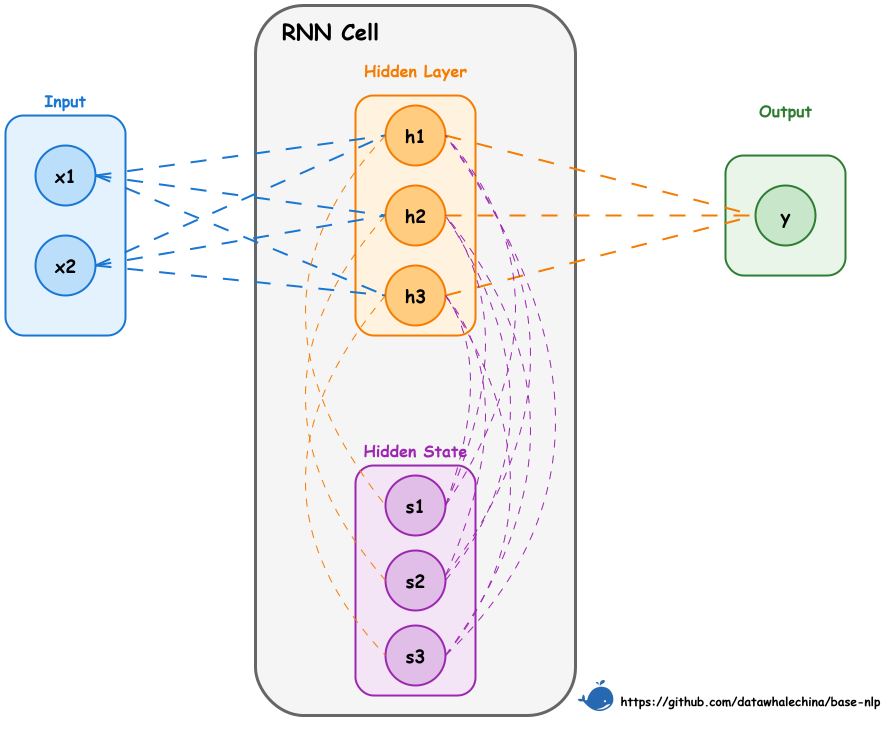

# 循环神经网络

## 一、如何处理序列信息

> 在文本数值化后（将文本分词并转为一个静态的稠密的词向量），从一个词向量序列中有效地提取整个序列的特征
>
> 例如：对于一个意图识别任务，需要将指令“播放周杰伦的《稻香》”归类到“音乐播放”。目前已经能得到“播放”、“周杰伦”、“的”、“《稻香》”这几个词元各自的词向量，但如何将这些向量融合成一个能代表整句指令含义的“文本向量”，并送入分类器呢？

### 简单方法的局限性

> 针对将词向量序列融合成一个定长的文本向量这一需求，早期的解决方案主要集中在对词向量的简单组合上

#### 词袋法

> 将所有词向量相加或取平均，完全忽略了语序信息，将所有词语视为同等重要

#### 全连接网络（Fully Connected Network ，FCN）

> 先求和再FCN 或反过来
>
> 为了处理变长的句子，在每个时间步（每个词元的位置）上使用的全连接层都必须共享同一套权重参数，导致了完全没有考虑到他前面出现的其他词，每个词元仍然是孤立处理的，模型无法理解词元之间的顺序关系和上下文依赖，**<u>也就是没有捕获序列特征</u>**
>
> ```
> 设输入序列为 [x₁, x₂, x₃, x₄]，共享的全连接层参数为 W 和 b：
> h₁ = W·x₁ + b
> h₂ = W·x₂ + b
> h₃ = W·x₃ + b
> h₄ = W·x₄ + b
> 每个 hᵢ 只依赖 xᵢ，不依赖 x₁, x₂, x₃。
> 
> ┌─────────────────────────────────────────────────────────────────────┐
> │           共享FCN处理序列的问题（每个词元独立处理）                   │
> ├─────────────────────────────────────────────────────────────────────┤
> │                                                                     │
> │  输入序列: [x₁, x₂, x₃, x₄]                                        │
> │                                                                     │
> │           x₁ ──→ FCN ──→ h₁ ──┐                                    │
> │           x₂ ──→ FCN ──→ h₂ ──┤                                    │
> │           x₃ ──→ FCN ──→ h₃ ──┼──→ 聚合 ──→ 输出                   │
> │           x₄ ──→ FCN ──→ h₄ ──┘                                    │
> │                                                                     │
> │  问题：                                                             │
> │  • h₁ 只知道 x₁，不知道 x₂, x₃, x₄                                │
> │  • h₂ 只知道 x₂，不知道 x₁, x₃, x₄                                │
> │  • h₃ 只知道 x₃，不知道 x₁, x₂, x₄                                │
> │  • h₄ 只知道 x₄，不知道 x₁, x₂, x₃                                │
> │                                                                     │
> │  结果：聚合后的输出丢失了所有顺序信息！                               │
> │                                                                     │
> └─────────────────────────────────────────────────────────────────────┘
> ```
>
> **全连接层**
>
> 就像一个加权求和器：它把输入的每一个数值都乘上一个权重，然后求和，再加上一个偏置，最后（通常）通过一个激活函数输出
>
> 每个输出节点都与所有输入节点相连——这就是“全连接”名字的由来
>
> ```
> ┌─────────────────────────────────────────────────────────────────────┐
> │                        全连接层结构图                               │
> ├─────────────────────────────────────────────────────────────────────┤
> │                                                                     │
> │   输入层                   全连接层                  输出层         │
> │   (4个神经元)              (3个神经元)                             │
> │                                                                     │
> │      x₁ ──────────────────→ y₁                                     │
> │         ╲                 ╱                                         │
> │          ╲               ╱                                          │
> │      x₂ ──╲─────────────╱──→ y₂                                    │
> │            ╲           ╱                                            │
> │             ╲         ╱                                             │
> │      x₃ ────╲───────╱────→ y₃                                      │
> │               ╲     ╱                                               │
> │                ╲   ╱                                                │
> │      x₄ ────────╳───                                               │
> │                                                                     │
> │   每个输出 yⱼ = wⱼ₁x₁ + wⱼ₂x₂ + wⱼ₃x₃ + wⱼ₄x₄ + bⱼ               │
> │                                                                     │
> │   连接数 = 输入维度 × 输出维度 = 4 × 3 = 12 个权重                  │
> │                                                                     │
> └─────────────────────────────────────────────────────────────────────┘
> ```
>
> 

面对全连接网络在处理序列数据时的局限性，人们开始尝试借鉴计算机视觉领域的经验。在图像处理中大获成功的 CNN 也可以用于文本。

通过使用一维卷积核（窗口）滑过整个词向量序列，CNN 能够捕捉到词语的局部依赖关系（如n-grams）。

不过，CNN 的缺陷在于它的感受野是固定的。一个大小为3的卷积核，只能看到附近3个词的关系。虽然可以通过堆叠多层CNN来扩大感受野，但对于句子开头和结尾的长距离依赖，CNN 仍然难以有效捕捉，无法预先设定一个适用于所有句子的“最佳”窗口大小

## 二、引入“记忆”的RNN（循环神经网络）

### 1. RNN结构

> RNN：记住在当前词元之前看过的信息
>
> 在处理序列的每一步时，网络不仅接收当前时间步的输入$x_t$，还会接收来自上一步的“记忆”——隐藏状态$h_{t-1}$，然后将两部分信息融合，生成当前步的输出$h_t$，并做为新的记忆传递给下一步
>
> 模型会首先像全连接网络一样处理当前输入 $x_t$ 得到 $U_{xt}$，同时引入另一个全连接层处理来自上一步的隐藏状态 $h_{t−1}$ 得到 $W_{h_{t−1}}$，最后将这两部分信息相加并通过一个激活函数（如 tanh）得到当前步的隐藏状态$h_t$。如此一来，$h_t$ 就同时包含了当前输入 $x_t$ 的信息和之前所有步的信息“摘要” $h_{t−1}$。
>
> ```
> ┌─────────────────────────────────────────────────────────────────────┐
> │                    RNN 单元的计算过程                                │
> ├─────────────────────────────────────────────────────────────────────┤
> │                                                                     │
> │                    ┌─────────────────┐                              │
> │                    │   h_{t-1}       │                              │
> │                    │  (上一时刻)      │                              │
> │                    └────────┬────────┘                              │
> │                             │                                       │
> │                             │ W·h_{t-1}                            │
> │                             ▼                                       │
> │   x_t ──→ U·x_t ──┐        ┌────────────┐                          │
> │                    ├──────→ │   加法     │                          │
> │         b ─────────┘        └─────┬──────┘                          │
> │                                   │                                 │
> │                                   ▼                                 │
> │                            ┌─────────────┐                         │
> │                            │   tanh      │                         │
> │                            └─────┬───────┘                         │
> │                                   │                                 │
> │                                   ▼                                 │
> │                    ┌─────────────────┐                              │
> │                    │      h_t        │                              │
> │                    │   (当前时刻)     │                              │
> │                    └─────────────────┘                              │
> │                                                                     │
> │  公式: h_t = tanh(U·x_t + W·h_{t-1} + b)                            │
> │                                                                     │
> └─────────────────────────────────────────────────────────────────────┘
> ```
>
> 

简单循环神经网络（Simple Recurrent Network，SRN）或 Elman Network 

RNN 单元在单个时间步内的计算流程

为了可视化，此图将隐藏状态拆分成了两个部分（Hidden State 和 Hidden Layer），但在计算上它们是紧密关联的



#### 步骤

将图中的流程分解并和$h_t = tanh(U_{x_{t}} +W_{h_{t-1}}+b)$对应起来

1. 输入 $x_t$ ：通过权重矩阵$U$连接到隐藏层（蓝色虚线部分），对应$U_{x_{t}}$
2. 前一时刻的隐藏状态$h_{t-1}$（紫色部分）：通过循环权重矩阵$W$连接到隐藏层（橙色部分），对应$W*h_{t-1}$
3. 当前时刻的隐藏状态$h_{t}$(橙色部分)：输入信息和旧状态信息融合并经过激活函数计算后的结果
4. 状态更新：新计算出的隐藏状态$h_t$将作为记忆传递给下一个时间步，成为下一个时间步计算中的$h_{t-1}$（紫色虚线）
5. 输出$O_t$：当前的隐藏状态$h_t$也可以被用来计算当前步的最终输出（如图中从 Hidden Layer 指向 Output 的橙色虚线），这通常需要再经过一个独立的输出层。

> 通过这种循环，RNN 单元在每个时间步都融合了当前输入和历史记忆，实现了信息的持续传递
>
> 在所有的时间步中，权重矩阵 $U$（输入到隐藏层）和 $W$（隐藏层到隐藏层）是共享的。这一机制让 RNN 能够处理任意长度的序列，并且大幅减少了模型参数。

## 三、RNN工作原理解析

### 1.文本分类示例

> 对于”播放周杰伦的《稻香》”

#### 准备输入

1. 将句子**分词**为 `["播放", "周杰伦", "的", "《稻香》"]`
2. 转换为 ID 序列 `[23, 58, 102, 203]`（假设）
3. 再通过**词嵌入**得到 4 个词向量 $x_1,x_2,x_3,x_4$。

假设每个向量是 128 维，则输入序列的形状为 (T,E)=(4,128)。

#### RNN处理

假设隐藏状态的维度为64（$H = 64$），初始隐藏状态$h_0$被初始化为零向量

1. 第1步（t=1）：输入第一个词向量 $x_1$（“播放”）和初始隐藏状态 $h_0$。通过计算 $h_1 = \tanh(U \cdot x_1 + W \cdot h_0 + b)$，得到的 $h_1$ 现在包含了“播放”的信息。
2. 第2步（t=2）：接下来输入第二个词向量 $x_2$（“周杰伦”）和上一步的隐藏状态 $h_1$。经过计算 $h_2 = \tanh(U \cdot x_2 + W \cdot h_1 + b)$，$h_2$ 现在融合了“播放”和“周杰伦”的信息。
3. 第3步（t=3）：紧接着，输入第三个词向量 $x_3$（“的”）和 $h_2$。计算得到 $h_3 = \tanh(U \cdot x_3 + W \cdot h_2 + b)$，此时 $h_3$ 融合了“播放周杰伦的”的信息。
4. 第4步（t=4）：输入第四个词向量 $x_4$（“《稻香》”）和 $h_3$。计算出 $h_4 = \tanh(U \cdot x_4 + W \cdot h_3 + b)$，使 $h_4$ 融合整个句子的信息。

最后得到的最终隐藏状态$h_4$就被认为是整个句子的动态上下文表示，也就是我们需要的“文本向量”

该向量捕获了整个句子的语序和语义信息，将这个向量送入一个标准的全连接分类层，就可以得到各个类别（如“音乐播放”、“天气查询”）的置信度

> 通过这种方式，RNN 成功地将一个变长的词向量序列，编码成了一个蕴含序列信息的固定长度的特征向量。

### 2.从静态到动态的飞跃

静态：$Type$ 词嵌入，Word2Vec等模型，词在字典中的静态含义

动态：$Token$ ，RNN的隐藏状态$h_t$，在不同语境下会根据前文生成不同的向量，具体的与上下文紧密相关的实例

> type：抽象的通用的概念
>
> toke（标记/实例）：在特定时空下的具体表现


Jeffrey Elman 在其论文中通过实验发现，即使不给网络任何语法规则，仅仅通过训练 RNN 预测序列中的下一个词，网络的隐藏状态空间也会自发地组织出**层级结构**。**动词**和**名词**会被映射到隐藏空间的不同区域，在名词区域内部，**有生命**和**无生命**的名词又会进一步区分。甚至具体的词（如 "Boy"）在不同句子位置的 Token 表示，也会根据句法角色（主语 vs 宾语）聚类在一起。这证明 RNN 不仅仅是在“记忆”历史，它实际上通过**预测任务**，隐式地学会了语言的**句法和语义结构**。

#### 动态表示 vs. 动态词向量

* 从原理机制上讲，是 RNN：正如本节所述，RNN 的隐藏状态$h_t$本质上就是一个随上下文变化的动态向量。它最早具备了“根据语境改变数值”的核心能力。
* 从 NLP 发展范式上讲，是 ELMo：在 ELMo (2018) 之前，大家通常只把 Word2Vec 这种查表得到的向量称为“词向量”，而把 RNN 的输出视为特定任务的中间状态。ELMo 的贡献在于它确立了“**<u>动态词向量</u>**”这一概念，并将其作为一种通用的、可迁移的预训练特征，改变了 NLP 的开发模式。

所以，RNN 发明了机制，而 ELMo 普及了范式

## 四、实现一个RNN

### 1.RNN公式简化

去掉偏置项 $h_t = tanh(U_{x_t} + W_{h_{t-1}})$

### 2.数据准备

> 一个简单的词表，并为句子“播放周杰伦的《稻香》”中的每个词生成一个随机的词向量，将它们组合成形状为 (1, 4, 128) 的张量，作为 RNN 模型的输入；
>
> 同时也设置了一些基本参数（例如将隐藏节点数设为 3，即 H=3，以便和前文的 RNN 结构图对应，实际应用中一般会远大于 3）
>
> 并通过 prepare_inputs 函数将这一数据准备过程封装起来。

```python
import torch
import torch.nn as nn
import numpy as np

# 约定: (B, T, E, H) 分别表示 批次/序列长度/输入维度/隐藏维度
# 输入维度 ： 特征？
B, E, H = 1, 128, 3

def prepare_inputs():
    """
    使用 NumPy 准备输入数据
    使用示例句子: "播放 周杰伦 的 《稻香》"
    构造最小词表和随机(可复现)词向量, 生成形状为 (B, T, E) 的输入张量。
    """
    np.random.seed(42)
    vocab = {"播放": 0, "周杰伦": 1, "的": 2, "《稻香》": 3}
    tokens = ["播放", "周杰伦", "的", "《稻香》"]
    ids = [vocab[t] for t in tokens]

    # 词向量表: (V, E)
    V = len(vocab)
    # 4 * 128 词向量表（包含所有4个词的向量）
    emb_table = np.random.randn(V, E).astype(np.float32)

    # 取出序列词向量并加上 batch 维度: (B, T, E)
    # 按特定顺序取出的序列（"播放", "周杰伦", "的", "《稻香》"）
    # vectors = emb_table[ids] 
    # vectors[Nont] 给输入序列添加 batch 维度。
    x_np = emb_table[ids][None]
    return tokens, x_np
```

### 3.基于Numpy实现RNN

实现$h_t = \tanh(U x_t + W h_{t-1})$

（1）**初始化**: 创建一个全零的初始隐藏状态 `h_prev`，作为处理**每个序列**开始前的“空白记忆”。

（2）**逐帧处理**: 使用循环遍历序列中的每一个时间步（词元）。

（3）**核心计算**: 在循环内部，实现 $h_t = \tanh(x_t U + h_{t-1} W)$ 的逻辑。具体是对当前时间步的输入 $x_t$ 和上一步的隐藏状态 $h_{prev}$ 分别进行线性变换，将两者相加后通过 `tanh` 激活函数，得到融合了上下文的新隐藏状态 $h_t$。

（4）**状态更新**: 将当前计算出的 $h_t$ 赋值给 `h_prev`，作为下一个时间步的输入，实现“循环”传递。

（5）**结果保存**: 将每一步计算出的隐藏状态 $h_t$ 保存下来，最终组合成一个包含所有时间步输出的张量。

```python
def manual_rnn_numpy(x_np, U_np, W_np):
    # B 批次大小 1
    # T 序列长度 几个词 4
    B_local, T_local, _ = x_np.shape
    # 初始化 h_0 为零向量 1 * 3
    h_prev = np.zeros((B_local, H), dtype=np.float32)
    
    steps = []
    # 按时间步循环
    for t in range(T_local):
        # 取所有批次、第 t 个位置、所有特征
        x_t = x_np[:, t, :]
        # 核心公式实现
        # x_t @ U_np：输入变换 (B, E) × (E, H) → (B, H)
        # h_prev @ W_np：循环变换 (B, H) × (H, H) → (B, H)
        h_t = np.tanh(x_t @ U_np + h_prev @ W_np)
        steps.append(h_t)
        h_prev = h_t # 更新状态
    # 将 (T, B, H) 堆叠成 (B, T, H)
    return np.stack(steps, axis=1), h_prev

```

### 4.PyTorch的 `nn.RNN`实现

> PyTorch提供了高度封装的`nn.RNN`模型，内部完成了经过优化的循环计算

```python
def pytorch_rnn_forward(x, U, W):
    rnn = nn.RNN(
        input_size=E,        # 输入特征维度
        hidden_size=H,       # 隐藏状态维度
        num_layers=1,        # 单层 RNN，累积
        nonlinearity='tanh', # 激活函数
        bias=False,          # 不使用偏置
        batch_first=True,    # 输入格式为 (B, T, E)
        bidirectional=False, # 单向 RNN
    )
    # 在 PyTorch 中，默认情况下所有操作都会记录计算图
	# 用于后续的自动求导（反向传播）

    # 在这个代码块内，所有操作都不会记录梯度
    with torch.no_grad():
        # PyTorch 内部存放的是转置后的权重
        # copy_ 原地复制
        rnn.weight_ih_l0.copy_(U.T)
        rnn.weight_hh_l0.copy_(W.T)
    # 写法2：等价写法
    # torch.set_grad_enabled(False)
    # rnn.weight_ih_l0.copy_(U.T)
    # torch.set_grad_enabled(True)
    y, h_n = rnn(x)
    # squeeze删除维度0
    return y, h_n.squeeze(0)

```

- `input_size`（$E$）: 输入特征 $x_t$ 的维度。在 NLP 中，这通常是词嵌入的维度 `embedding_dim`。
- `hidden_size`（$H$）: 隐藏状态 $h_t$ 的维度。这代表了 RNN “记忆”的容量，也是其隐藏层的节点数。
- `num_layers`: RNN 的层数。默认是1。如果大于1，会构成一个“堆叠 RNN”，即前一层RNN在所有时间步的输出，会作为后一层 RNN 的输入。
- `bias`: 是否使用偏置项。默认为 `True`。如果为真，则公式会变为 $h_t = \tanh(U x_t + b_{ih} + W h_{t-1} + b_{hh})$。在示例中设为 `False` 以便与手写版本对齐。
- `batch_first`: 一个非常重要的维度顺序参数。默认为 `False`，此时输入张量的形状应为 `(T, B, E)`。在代码中设为 `True`，使得输入形状为更符合直觉的 `(B, T, E)`，其中 `B`是批次大小，`T`是序列长度。
- `bidirectional`: 是否构建一个双向RNN。默认为 `False`。双向RNN能同时考虑过去和未来的上下文，后续章节将对此进行介绍。

### 5.数值对齐验证

```python
# 将NumPy结果转回PyTorch张量
out_manual = torch.from_numpy(out_manual_np)

# 使用 allclose 进行浮点数精度下的严格比较
print("逐步输出一致:", torch.allclose(out_manual, out_torch, atol=1e-6))
# 输出: True
```

## 五、双向循环神经网络

> RNN在处理序列时，信息是单向流动的，在任意时刻t只使用了t时刻及之前的信息
>
> 在很多自然语言处理任务中，一个词的含义往往不仅依赖于它前面的词，还与它后面的词密切相关
>
> 为了利用未来的信息，一种早期的尝试是引入“时间延迟”（Time Delay）：即在预测t时刻的输出时，允许模型看到t+M 时刻的输入。然而，这个延迟窗口M 是一个需要人工调整的超参数——窗口太小，未来信息不足；窗口太大，模型反而难以聚焦于局部
>
> 为了更好地同时利用过去（前文）和未来（后文）的上下文信息，双向循环神经网络（Bidirectional RNN，BiRNN）被提出

### 1.BiRNN的结构和原理

#### 两个完全独立的RNN

* 正向RNN：从左到右读取输入序列，计算出正向隐藏状态$(\overrightarrow{h_1}, \overrightarrow{h_2}, ..., \overrightarrow{h_T})$
* 反向RNN：从右到左读取，计算出反向隐藏状态$(\overleftarrow{h_1}, \overleftarrow{h_2}, ..., \overleftarrow{h_T})$


在任意时间步 $t$，BiRNN 的最终输出 $h_t$ 则是将该时间步对应的正向 RNN 隐藏状态 $\overrightarrow{h_t}$ 和反向 RNN 隐藏状态 $\overleftarrow{h_t}$ 进行拼接（Concatenate）得到的：

$$
h_t = [\overrightarrow{h_t} ; \overleftarrow{h_t}] 
$$


 $h_t$ 就同时包含了输入序列中 $t$ 时刻左右两侧的上下文信息。需要注意，正向和反向的两个 RNN 拥有各自独立的权重参数，它们在训练过程中被 **同时优化**

#### 正反RNN协同进行

> 为什么不分别训练一个正向 RNN 和一个反向 RNN，最后将它们的输出取平均（线性意见池）或几何平均（对数意见池）

BiRNN 的优势在于它是在同一个损失函数下同时训练两个方向的权重。

正向和反向的特征提取是协同进行的，能够更好地适应目标任务，而不需要假设两个方向的预测是相互独立的。

而且，BiRNN 彻底消除了对“时间延迟”参数 M 的依赖，模型自动利用所有可用的过去和未来信息。


由于最终的输出是两个独立 RNN 隐藏状态的拼接，如果每个 RNN 的 `hidden_size` 都为 $H$，那么 BiRNN 在每个时间步的输出维度将变为 $2H$。在 PyTorch 的 `nn.RNN` 模块中，只需将 `bidirectional` 参数设置为 `True` 即可轻松构建一个双向 RNN。其输出 `y` 的最后一个维度（特征维度）将是 `hidden_size` 的两倍，而最终隐藏状态 `h_n` 的第一个维度将是 `num_layers * 2`，分别存储了正向和反向 RNN 在最后一个时间步的隐藏状态。

### 2.作用和局限

BiRNN 的主要作用是它为序列中的每个元素都提取了更完整的上下文相关的特征，而不是像单向 RNN 那样只依赖于过去的信息，这使得它在许多 NLP 任务中（如命名实体识别、情感分析、机器翻译等）都取得了比单向 RNN 更好的效果。

BiRNN 仍存在局限，因为首先，它并没有解决 RNN 的长距离依赖问题，无论是正向还是反向的 RNN，它们本身依然会面临梯度消失或梯度爆炸的挑战；其次，由于需要处理完整的序列才能计算反向信息，BiRNN 无法被用于需要实时预测的场景（例如，根据用户已输入的内容实时推荐下一个词）。

## 六、随时间反向传播

> RNN的训练实质是标准反向传播（Backpropagation，BP）在时间展开图上的直接应用
>
> ​									——随时间反向传播（Backpropagation Through Time，BPTT）
>
> 将RNN沿时间维度展开，可视作一个各层参数共享的深层前馈网络，进而在此结构上执行通用的反向传播算法

假设整个序列的总损失 $L$ 是所有时间步损失 $L_t$ 的总和，即 $L = \sum_{t=1}^{T} L_t$。我们的目标是计算损失 $L$ 对共享参数 $U$ 和 $W$ 的梯度。根据加法求导法则，总梯度等于每个时间步损失所贡献的梯度的总和：

$$
\frac{\partial L}{\partial W} = \sum_{t=1}^{T} \frac{\partial L_t}{\partial W} 
$$


主要的挑战在于计算单个时间步的梯度 $\frac{\partial L_t}{\partial W}$。由于 $W$ 在每个时间步都参与了计算，当前时刻的隐藏状态 $h_t$ 不仅依赖于当前输入 $x_t$，还通过 $h_{t-1}$ 间接依赖于之前所有时间步的输入和状态。因此，在 $t$ 时刻的损失，其梯度必须沿着时间反向传播，一直追溯到序列的开端。使用链式法则（向量-导数矩阵形式）， $\frac{\partial L_t}{\partial W}$ 可分解为：


$$
\frac{\partial L_t}{\partial W} = \sum_{k=1}^{t} \underbrace{\frac{\partial L_t}{\partial h_t}}_{\text{梯度}} \cdot \underbrace{\frac{\partial h_t}{\partial h_k}}_{\text{导数矩阵连乘}} \cdot \underbrace{\frac{\partial h_k}{\partial W}}_{\text{直接影响}}
$$

其中， $\frac{\partial h_k}{\partial W}$ 是 $h_k$ 关于参数 $W$ 的导数矩阵； $\frac{\partial h_t}{\partial h_k}$ 表示从第 $k$ 步到第 $t$ 步的“传播的导数矩阵”，其本身是导数矩阵的连乘：

$$
\frac{\partial h_t}{\partial h_k} = \prod_{i=k+1}^{t} \frac{\partial h_i}{\partial h_{i-1}} 
$$

这个连乘的形式正是 RNN 产生问题的根源所在。

## 七、RNN的局限性

> 理论上可以捕捉长距离依赖，但在实践中，基于 BPTT 的反向传播在时间维度上的导数矩阵连乘，带来了以下问题

### 1.梯度消失与梯度爆炸


BPTT 链式求导的关键，在于梯度的反向传播路径上会形成一个连乘项 $\prod_{i=k+1}^{t} \frac{\partial h_i}{\partial h_{i-1}}$。以 $h_i = \tanh(U x_i + W h_{i-1})$ 为例，其传播的导数矩阵近似为：

$$
\frac{\partial h_i}{\partial h_{i-1}} \approx J_{\tanh}(U x_i + W h_{i-1}) \cdot W \tag{3.6}
$$

其中 $J_{\tanh}$ 表示 $\tanh$ 的导数矩阵。这意味着，从遥远的 $k$ 步到当前 $t$ 步的梯度传递，需要经历 $t-k$ 次与权重矩阵 $W$ 和激活函数导数矩阵的相乘。

在 RNN 中，权重矩阵 $W$ 的值通常会被初始化为较小的值，如果 $W$ 的范数（可以理解为其对向量的缩放能力）小于1，或者激活函数的导数（如 $\tanh'$ 最大为 1，通常小于 1）导致连乘项变小，那么多次相乘之后，梯度值会以指数级速度衰减，迅速趋近于 0，这就是**梯度消失（Vanishing Gradients）**。

当序列很长时（$t-k$ 很大），来自遥远过去的梯度信号在传播到当前步时，几乎完全消失。反之，如果 $W$ 的范数大于 1，梯度值则会指数级增长，最终变成一个非常大的数值（Inf 或 NaN），导致模型训练崩溃，这被称为**梯度爆炸（Exploding Gradients）**。

梯度爆炸问题相对容易发现和处理，一种常见的解决方法是**梯度裁剪（Gradient Clipping）**，也就是当梯度的范数超过某个阈值时，就将其缩放到该阈值。

### 2.长距离依赖

> 梯度消失直接导致了长距离依赖问题

（1）反向传播视角：梯度消失意味着，模型无法学习到序列中相距遥远的词之间的依赖关系。正如 Werbos 所指出的，BPTT 本身是计算梯度的精确方法，但深层网络（或长序列）中的连乘效应是数学上的必然。例如，在句子 “孙悟空初到天庭时，被玉帝封为‘弼马温’，他嫌官小，心中不忿，便打出天门，返回花果山，自封‘齐天大圣’，后来又大闹天宫，搅乱了蟠桃盛会，偷吃了老君的金丹，最终被如来佛祖镇压在五行山下。五百年后，当有神仙旧事重提，用这个官职来称呼他时，依然是在嘲讽他。” 中，要正确理解结尾处“嘲讽”的含义，模型必须能关联到句子最开头的“弼马温”是一个低微官职这一事实。但由于两者之间间隔了极长的叙述，误差梯度在从“嘲讽”反向传播到“弼马温”时，可能已经衰减为零，导致模型无法捕捉到这种关键的远距离语义依赖。

（2）正向传播视角：也可以理解为信息遗忘或近期偏置。在正向计算过程中，每一步的信息都会被新的输入和循环权重W “稀释”或“覆盖”。经过足够多的时间步后，序列最初的信息在隐藏状态中可能已所剩无几。这就好像两个句子，即使开头的词不同，在经过很长的相同后续序列后，它们最终的隐藏状态也可能变得几乎没有差别，模型“遗忘”了最初的差异。

### 3.单向性

常规 RNN 的信息流是单向的， $t$ 时刻的计算只能利用 $t$ 时刻之前的信息，无法利用未来的上下文信息。但在很多 NLP 任务中（如完形填空、机器翻译），一个词的含义同时取决于它的前文和后文。**双向循环神经网络**能够通过结合正向和反向的信息流来解决单向性的问题。

此外，为了学习更复杂的特征表示，还可以将多个 RNN 层堆叠起来，构成**深度循环神经网络**。然而，这些变体都未能从根本上解决梯度传播带来的长距离依赖问题。

为了攻克这一核心难题，研究者们设计了两种更为精巧的门控 RNN 结构，分别是**长短期记忆网络**和**门控循环单元**，下一节将对此进行详细探讨。

## RNN手写代码

```python
import numpy as np

# 约定: (B, T, E, H) 分别表示 批次/序列长度/输入维度/隐藏维度
B, E, H = 1, 128, 3

def prepare_inputs():
    """
    使用 NumPy 准备输入数据
    使用示例句子: "播放 周杰伦 的 《稻香》"
    构造最小词表和随机(可复现)词向量, 生成形状为 (B, T, E) 的输入张量。
    """
    np.random.seed(42)
    vocab = {"播放": 0, "周杰伦": 1, "的": 2, "《稻香》": 3}
    tokens = ["播放", "周杰伦", "的", "《稻香》"]
    ids = [vocab[t] for t in tokens]

    # 词向量表: (V, E)
    V = len(vocab)
    emb_table = np.random.randn(V, E).astype(np.float32)

    # 取出序列词向量并加上 batch 维度: (B, T, E)
    x_np = emb_table[ids][None]
    return tokens, x_np


class SimpleRNN:
    """使用 NumPy 实现的简单 RNN"""
    
    def __init__(self, input_size, hidden_size):
        """
        初始化 RNN 参数
        
        Args:
            input_size: 输入维度 E
            hidden_size: 隐藏状态维度 H
        """
        self.input_size = input_size
        self.hidden_size = hidden_size
        
        # 初始化权重和偏置
        self.U = np.random.randn(hidden_size, input_size) * 0.01   # 输入权重
        self.W = np.random.randn(hidden_size, hidden_size) * 0.01  # 循环权重
        self.b = np.zeros(hidden_size)                              # 偏置
        
    def forward(self, x, h_prev=None):
        """
        RNN 前向传播
        
        Args:
            x: 输入序列 (B, T, E)
            h_prev: 初始隐藏状态 (B, H)，默认为零向量
        
        Returns:
            h_all: 所有时间步的隐藏状态 (B, T, H)
            h_last: 最后一个时间步的隐藏状态 (B, H)
        """
        B, T, E = x.shape
        H = self.hidden_size
        
        # 初始化隐藏状态
        if h_prev is None:
            h_prev = np.zeros((B, H))
        
        # 存储所有时间步的隐藏状态
        h_all = []
        h_t = h_prev
        
        for t in range(T):
            # 当前时间步的输入
            x_t = x[:, t, :]  # (B, E)
            
            # RNN 核心公式: h_t = tanh(U·x_t + W·h_{t-1} + b)
            u = x_t @ self.U.T  # (B, H)  注意：@ 是矩阵乘法
            w = h_t @ self.W.T  # (B, H)
            h_t = np.tanh(u + w + self.b)
            
            h_all.append(h_t)
        
        # 堆叠所有时间步: (B, T, H)
        h_all = np.stack(h_all, axis=1)
        
        return h_all, h_t


# ==================== 测试代码 ====================

if __name__ == "__main__":
    print("="*60)
    print("RNN 前向传播演示")
    print("="*60)
    
    # 1. 准备输入
    tokens, x = prepare_inputs()
    B, T, E = x.shape
    print(f"\n【输入数据】")
    print(f"  句子: {' → '.join(tokens)}")
    print(f"  输入形状: {x.shape} (B={B}, T={T}, E={E})")
    print(f"  输入向量（前5维）:\n{x[0, 0, :5]}...")
    
    # 2. 创建 RNN 模型
    rnn = SimpleRNN(input_size=E, hidden_size=H)
    print(f"\n【RNN 模型】")
    print(f"  输入维度: {E}")
    print(f"  隐藏维度: {H}")
    print(f"  参数量: {E*H + H*H + H:,}")
    
    # 3. 前向传播
    h_all, h_last = rnn.forward(x)
    print(f"\n【前向传播结果】")
    print(f"  所有时间步隐藏状态形状: {h_all.shape} (B={B}, T={T}, H={H})")
    print(f"  最后隐藏状态形状: {h_last.shape}")
    
    # 4. 打印每个时间步的隐藏状态
    print(f"\n【每个时间步的隐藏状态】")
    for t, token in enumerate(tokens):
        print(f"  t={t}: '{token}' → h_{t} = {h_all[0, t]}")
    
    # 5. 验证信息传递
    print(f"\n【信息传递验证】")
    print(f"  h0 只包含 '{tokens[0]}' 的信息")
    print(f"  h1 包含 '{tokens[0]}' 和 '{tokens[1]}' 的信息")
    print(f"  h2 包含 '{tokens[0]}', '{tokens[1]}', '{tokens[2]}' 的信息")
    print(f"  h3 包含全部 '{' → '.join(tokens)}' 的信息")
    
    # 6. 验证不同顺序的结果不同
    print(f"\n【验证顺序敏感性】")
    
    # 创建不同顺序的输入
    tokens_rev = ["《稻香》", "的", "周杰伦", "播放"]
    ids_rev = [0, 2, 1, 3]  # 重新映射
    x_rev = x[0, [3, 2, 1, 0], :][None]  # 反转顺序
    
    _, h_last_rev = rnn.forward(x_rev)
    
    print(f"  原始顺序: {' → '.join(tokens)}")
    print(f"  反转顺序: {' → '.join(tokens_rev)}")
    print(f"  原始顺序的最后隐藏状态: {h_last[0, :5]}...")
    print(f"  反转顺序的最后隐藏状态: {h_last_rev[0, :5]}...")
    
    if not np.allclose(h_last, h_last_rev):
        print(f"  ✅ 结果不同！RNN 能够区分词序！")
    else:
        print(f"  ❌ 结果相同（不应该发生）")
```

# LSTM 与 GRU

> 长短期记忆网络 (LSTM) 与门控循环单元 (GRU)
>
> 缓解长距离依赖

## 一、LSTM与门控制机制

> 常规RNN每一步的新信息都会与旧信息（隐藏状态）无差别地混合，并通过权重矩阵 $W$ 进行变换。
>
> 这种强制性的矩阵乘法，无论信息重要与否，都会在反向传播中形成梯度累乘，导致梯度信号的衰减或爆炸。
>
> LSTM 的设计哲学是**赋予网络自行决定信息取舍的能力**。它不再强制性地混合所有信息，而是引入了 **“门控机制”（Gating Mechanism）**，让模型在训练过程中学会**有选择地**让信息通过、遗忘旧信息或输出信息。

### 1.从单一状态到双规并行

> LSTM与RNN在隐藏状态$h_t$上不同，引入了两个独立的状态向量在时间轴上并行传递

* 细胞状态 （Cell State ，$c_t$）：LSTM的核心，原始论文中称之为 **“恒定误差旋转木马”（Constant Error Carousel, CEC）**。可以把它想象成一条“信息高速公路”或“传送带”，负责在整个序列中传递**长期记忆**。信息可以直接在这条传送带上流动，仅经过按元素的加权与相加，没有额外的矩阵连乘，从而极大地缓解了梯度消失问题。
* 隐藏状态（Hidden State, $h_t$）: 与 RNN 中的隐藏状态类似，代表了当前时间步的**短期记忆**和**最终输出**。
    $h_t$ 的计算依赖于当前的细胞状态 $c_t$。

LSTM 通过门控单元，来控制细胞状态 $c_t$ 这条“高速公路”在每个时间点应该**遗忘**什么旧内容，以及应该**写入**什么新内容。

### 2.门的结构

LSTM 中的“门”是一种让信息选择性通过的结构，设计灵感来源于数字电路中的逻辑门。

它的实现非常简单，就是一个以 **Sigmoid** 为激活函数的全连接层。

这个全连接层的输入通常是当前时间步的输入 $x_t$ 和上一个时间步的隐藏状态 $h_{t-1}$ 的拼接向量，经线性变换后通过 Sigmoid 函数，最终输出一个元素值在 **(0, 1)** 区间内的向量。

这个向量会与另一个向量进行**按元素乘法**，当门输出向量的某个元素接近 **1** 时意味着“允许”对应维度的信息完全通过，而当其接近 **0** 时则意味着“阻止”对应维度的信息通过，即“遗忘”或“忽略”它。

从另一个角度看，门控机制也是为了解决**权重冲突**问题。其中**输入门**保护细胞状态不受无关**输入**的干扰，**输出门**则保护其他单元不受当前细胞状态中无关**记忆**的干扰。LSTM 内部署了三个这样的门，来精确控制信息的流动。

## 二、LSTM单元结构


一个 LSTM 单元在 $t$ 时刻接收三个输入，当前输入 $x_t$、前一时刻的隐藏状态 $h_{t-1}$ 和前一时刻的细胞状态 $c_{t-1}$。然后，如图 3-2 所示它通过内部的三个门和一个 `tanh` 层，计算出新的细胞状态 $c_t$ 和隐藏状态 $h_t$。

<div align="center">
  
</div>

这里将当前输入$x_t$和前一时刻的隐藏状态$h_{t-1}$拼接起来，记为$[h_{t-1},x_t]$

LSTM内部的每一次线性变换都是作用在这个拼接后的向量上，只是各自使用不同的权重矩阵


> 这种拼接操作是一种常见的计算优化。
>
> 将两个向量拼接后再进行一次矩阵乘法，与对两个向量分别进行矩阵乘法然后相加，其结果是等价的。
>
> 例如， $W \cdot [h_{t-1}, x_t]$ 等价于 $W_h \cdot h_{t-1} + W_x \cdot x_t$，其中 $W$ 被相应地拆分为 $W_h$ 和 $W_x$ 两部分。
>
> 这样做可以利用深度学习框架中优化过的大矩阵乘法操作，提升计算效率。


在深入公式之前，可以将上图中的计算模块与公式对应起来，以便理解信息流，图中各符号的含义如下：
- 每一个 `σ` （Sigmoid） 符号都对应一个**门**的计算，即遗忘门、输入门和输出门。
- `tanh` 符号有两个，分别负责生成**候选记忆**（$\tilde{c}_t$），以及对细胞状态 $c_t$ 进行处理，将其值压缩到 [-1, 1] 区间以计算最终的隐藏状态 $h_t$。
- `⊙`（圆圈）符号代表**按元素乘法**，这是门控机制发挥作用的关键。
- `+`（圆圈）符号代表**按元素加法**，用于更新细胞状态。

### 1.第一步：遗忘门（Forget Gateway）

> 决定从细胞状态中丢弃什么信息，做出这个决定的Sigmoid层是遗忘门
>
> 审视$h_{t-1}$和$x_t$，然后为$c_{t-1}$的每个数值输出一个介于0和1之前的“遗忘系数”
>
> 系数接近1表示几乎完全保留，接近0表示几乎完全丢弃
>
> 1997 年提出的原始 LSTM 结构中并没有遗忘门，这一机制是由 Gers 等人在 2000 年引入的


$$
f_t = \sigma(W_f \cdot [h_{t-1}, x_t] + b_f) 
$$

### 2.输入门与候选记忆（Input Gateway & Candidate Memory）

> 决定在细胞状态中存储什么新信息，分两步

1. 输入门：Sigmoid层，决定更新哪些值
    $$i_t = \sigma(W_i \cdot [h_{t-1}, x_t] + b_i) \tag{3.8}$$
2. 候选记忆： `tanh` 层，创建一个新的候选记忆向量 $\tilde{c}_t$，这是准备添加到细胞状态中的新内容。
    这部分的计算与常规 RNN 的计算非常相似。$$\tilde{c}_t = \tanh(W_c \cdot [h_{t-1}, x_t] + b_c) $$

### 3.更新细胞状态（Cell State Update）

旧状态 $c_{t-1}$ 更新为新状态 $c_t$，此步骤对应于图中细胞状态传送带上的核心操作。

首先，将旧状态 $c_{t-1}$ 与遗忘门 $f_t$ 的输出进行**逐元素相乘**，丢弃掉决定要忘记的部分；

然后，将输入门 $i_t$ 与候选记忆 $\tilde{c}_t$ **逐元素相乘**，筛选出需要加入的新信息；

最后，将这两部分**相加**，得到新的细胞状态 $c_t$。

$$c_t = (f_t \odot c_{t-1}) + (i_t \odot \tilde{c}_t) $$

### 4、输出门（Output Gate）

最后，我们需要决定输出什么。输出将基于我们的细胞状态，但会是一个过滤后的版本。输出的生成分为两步：

1. 输出门：一个 Sigmoid 层（“输出门”）决定了细胞状态的哪些部分将被输出。
    $$o_t = \sigma(W_o \cdot [h_{t-1}, x_t] + b_o) $$
2. 计算隐藏状态：将刚刚更新的细胞状态 $c_t$ 通过 `tanh` 函数（将其值规范化到 -1 和 1 之间），并将其与输出门 $o_t$ 的结果**逐元素相乘**，最终只输出我们决定的那部分信息作为隐藏状态 $h_t$。
    $$h_t = o_t \odot \tanh(c_t) $$

这个 $h_t$ 将作为当前时间步的最终输出，并传递给下一个时间步。

## 三、LSTM如何缓解长距离依赖

> 缓解的关键在于**细胞状态 $c_t$ 的更新法则**。

在 RNN 中，梯度在时间步之间反向传播时，每一步都必须乘以同一个权重矩阵 $W$。

当序列很长时，这种连乘操作（$W \cdot W \cdot W \dots$）极易导致梯度消失或爆炸。

而在 LSTM 中，梯度的传播路径被分成了两条。

* 一条是通过隐藏状态 $h_t$ 传递的，与 RNN 类似，依然会经过激活函数的导数和权重矩阵，存在梯度衰减的风险。

* 另一条，也是更重要的一条，是通过细胞状态 $c_t$ 传递的。

我们来考察损失 $L$ 对前一时刻细胞状态 $c_{t-1}$ 的梯度，根据链式法则：
$$
\frac{\partial L}{\partial c_{t-1}} = \frac{\partial L}{\partial c_t} \frac{\partial c_t}{\partial c_{t-1}} 
$$

其中，细胞状态的更新公式为 $c_t = (f_t \odot c_{t-1}) + (i_t \odot \tilde{c}_t)$。可以看到，$c_t$ 对 $c_{t-1}$ 的偏导数直接就是遗忘门 $f_t$（另一项与 $c_{t-1}$ 无关，导数为0）。因此：

$$
\frac{\partial L}{\partial c_{t-1}} = \frac{\partial L}{\partial c_t} \odot f_t 
$$

这个关系非常关键。它表明，从 $t$ 时刻的细胞状态反向传播到 $t-1$ 时刻，梯度仅仅是**按元素乘以**了遗忘门 $f_t$ 的值，而**没有经过权重矩阵的乘法**。如果将这个链条一直追溯到更早的 $k$ 时刻，梯度就变成了：

$$
\frac{\partial L}{\partial c_k} = \frac{\partial L}{\partial c_t} \odot (f_t \odot f_{t-1} \odot \dots \odot f_{k+1})
$$

由此，**梯度的“高速公路”**得以建立，从序列末端到开端的梯度传递主要取决于一系列遗忘门 $f_t$ 的连乘。由于 $f_t$ 是一个独立的门控单元，它的值是在每次计算中动态生成的。如果模型在训练中发现某个早期信息非常重要，它可以通过学习将中间所有时间步的遗忘门 $f_t$ 的值都设置为接近 1。在这种情况下，梯度就可以几乎无衰减地从序列末端传播到序列开端。

这本质上构建了一种**可学习的依赖关系**，与常规 RNN 的结构性缺陷不同，LSTM 将长距离依赖问题转化成了一个**可学习**的问题。模型能够通过优化损失函数，自行调整门控单元的参数，来决定哪些信息需要长期记忆（通过将 $f_t$ 设置为 $\approx 1$ 来“记住”），哪些信息可以被舍弃（通过将 $f_t$ 设置为 $\approx 0$ 来“遗忘”）。

所以，我们不说 LSTM **解决**了梯度消失问题，而是极大地**缓解**了它。因为即使 $f_t$ 的值很接近1（例如0.99），在足够长的序列上连乘后，梯度依然会衰减。但相比 RNN 几十步就会出现问题的窘境，LSTM 已经实现了巨大的飞跃。

## 四、从零实现一个LSTM

例子 不含偏置项的简化版 LSTM，计算公式如下：

-   **遗忘门**: $f_t = \sigma(U_f x_t + W_f h_{t-1})$
-   **输入门**: $i_t = \sigma(U_i x_t + W_i h_{t-1})$
-   **候选记忆**: $\tilde{c}_t = \tanh(U_c x_t + W_c h_{t-1})$
-   **细胞状态更新**: $c_t = f_t \odot c_{t-1} + i_t \odot \tilde{c}_t$
-   **输出门**: $o_t = \sigma(U_o x_t + W_o h_{t-1})$
-   **隐藏状态更新**: $h_t = o_t \odot \tanh(c_t)$

### 1.基于Numpy实现LSTM

1. **初始化**: 我们第一步需要初始化两个零向量 `h_prev` 和 `c_prev`，分别作为处理序列开始前的“短期记忆”和“长期记忆”。
2. **逐帧处理**: 接着，使用 `for` 循环遍历序列中的每一个时间步，对每个时间步的输入进行处理。
3. **核心计算**: 在循环内部，严格遵循 LSTM 的四个步骤进行计算。
    我们首先要计算**遗忘门** `f_t`，决定从旧的细胞状态 `c_prev` 中忘记多少信息；
    然后计算**输入门** `i_t` 和**候选记忆** `c_tilde_t`，准备要写入的新信息；
    随后通过公式 `c_t = f_t * c_prev + i_t * c_tilde_t`，结合遗忘和记忆操作，得到新的细胞状态 `c_t`；
    最后计算**输出门** `o_t`，并结合 `tanh(c_t)` 生成新的隐藏状态 `h_t`。
4. **状态更新**: 在每一步计算结束后，执行 `h_prev, c_prev = h_t, c_t`，将当前计算出的状态传递给下一个时间步，完成“循环”过程。

```python
def manual_lstm_numpy(x_np, weights):
    U_f, W_f, U_i, W_i, U_c, W_c, U_o, W_o = weights
    B_local, T_local, _ = x_np.shape
    h_prev = np.zeros((B_local, H), dtype=np.float32)
    c_prev = np.zeros((B_local, H), dtype=np.float32)
    
    steps = []
    # 按时间步循环
    for t in range(T_local):
        x_t = x_np[:, t, :]
        
        # 1. 遗忘门
        f_t = sigmoid(x_t @ U_f + h_prev @ W_f)
        
        # 2. 输入门与候选记忆
        i_t = sigmoid(x_t @ U_i + h_prev @ W_i)
        c_tilde_t = np.tanh(x_t @ U_c + h_prev @ W_c)
        
        # 3. 更新细胞状态
        c_t = f_t * c_prev + i_t * c_tilde_t
        
        # 4. 输出门与隐藏状态
        o_t = sigmoid(x_t @ U_o + h_prev @ W_o)
        h_t = o_t * np.tanh(c_t)
        
        steps.append(h_t)
        h_prev, c_prev = h_t, c_t
        
    outputs = np.stack(steps, axis=1)
    return outputs, h_prev, c_prev
```

### 2.LSTM 实现层面的优化

在实际的深度学习框架（如 PyTorch、TensorFlow）中，为了提高计算效率，LSTM 的实现通常会进行一项优化。

回顾 LSTM 的计算过程，遗忘门、输入门、候选记忆和输出门都对拼接向量 $[h_{t-1}, x_t]$ 进行了独立的线性变换：

- $f_t$ : $W_f \cdot [h_{t-1}, x_t] + b_f$
- $i_t$ : $W_i \cdot [h_{t-1}, x_t] + b_i$
- $\tilde{c}_t$ : $W_c \cdot [h_{t-1}, x_t] + b_c$
- $o_t$ : $W_o \cdot [h_{t-1}, x_t] + b_o$

这相当于对同一个输入进行了四次独立的线性层计算。

为了优化，框架会将这四个权重矩阵和偏置项在内部进行**拼接**，将与输入 $x_t$ 相关的权重 $W_{fx}, W_{ix}, W_{cx}, W_{ox}$ 拼接成一个大的权重矩阵 $W_{x}$，同时将与隐藏状态 $h_{t-1}$ 相关的权重 $W_{fh}, W_{ih}, W_{ch}, W_{oh}$ 拼接成一个大的权重矩阵 $W_{h}$。

这样，四次独立的矩阵乘法就可以被合并成两次更大规模的矩阵乘法，然后再将结果切分成四份，分别送入各自的激活函数。这种方式能更好地利用 GPU 的并行计算能力，提升运算速度。

## 五、门控循环单元（GRU）

> GRU 由 Cho 等人在 2014 年提出 。
>
> 它最初是在 **RNN Encoder-Decoder** 框架下被提出的，是为了解决统计机器翻译中的短语表示问题。
>
> 实验表明，这种结构能够很好地捕捉短语的语义和句法结构，并且相比 LSTM 更易于训练。

### 1.GRU的主要改进

* 合并细胞状态和隐藏状态，只有一个同时包含长期记忆并作为输出的状态向量$h_t$在时间步之间传递
* 简化门控结构：三个门简化为两个门
    * 更新门（Update Gate，$z_t$）：类似于LSTM中耦合的遗忘门和输入门，同时决定了保留多少旧信息以及接收多少新信息
    * 重置门（Rest Gate，$r_t$）：决定在计算候选状态是忽略多少旧信息

> 这种设计让每个隐藏单元能够自适应地捕捉不同时间尺度的依赖关系，从而更灵活地处理长短句法结构。

### 2.GRU单元结构与公式


其计算过程可以分解为以下四步：

（1）**重置门（$r_t$）**

决定如何将新输入 $x_t$ 与之前的记忆 $h_{t-1}$ 结合，这个门控制着哪些旧信息可以被用来计算“候选记忆”。计算公式如下：

$$
r_t = \sigma(W_r \cdot [h_{t-1}, x_t] + b_r) \tag{3.16}
$$

（2）**更新门（$z_t$）**

控制前一时刻的状态信息 $h_{t-1}$ 有多少能够被直接带入到当前时刻，这与 LSTM 的遗忘门功能相似。计算公式如下：

$$
z_t = \sigma(W_z \cdot [h_{t-1}, x_t] + b_z) \tag{3.17}
$$

（3）**候选记忆（$\tilde{h}_t$）**

计算当前时间步的候选隐藏状态。这个计算受到了**重置门** $r_t$ 的影响。$r_t$ 与 $h_{t-1}$ 逐元素相乘，如果 $r_t$ 的某个元素接近 0，则表示在计算候选记忆时，将完全忽略掉 $h_{t-1}$ 对应维度的信息。计算公式如下：

$$
\tilde{h}_t = \tanh(W_h \cdot [r_t \odot h_{t-1}, x_t] + b_h) \tag{3.18}
$$

（4）**最终隐藏状态（$h_t$）**

结合更新门 $z_t$、旧状态 $h_{t-1}$ 和候选记忆 $\tilde{h}_t$，生成当前时间步的最终输出 $h_t$。其中 $z_t \odot h_{t-1}$ 表示对旧状态 $h_{t-1}$ 中需要**保留**的信息， $(1-z_t) \odot \tilde{h}_t$ 表示从候选记忆 $\tilde{h}_t$ 中需要**选择**的新信息。这个更新机制非常巧妙，更新门 $z_t$ 的值在 0 到 1 之间，可以看作是一个“开关”。当 $z_t$ 接近 1 时，模型倾向于保留更多的旧信息 $h_{t-1}$；当 $z_t$ 接近 0 时，模型则倾向于保留更多的新信息。计算公式如下：

$$
h_t = z_t \odot h_{t-1} + (1 - z_t) \odot \tilde{h}_t \tag{3.19}
$$

## 六、LSTM的常见变体（了解）

> “窥孔连接”
>
> “耦合的输入/遗忘门”

### 1. 窥孔连接（Peephole Connections）

在标准 LSTM 中，三个门（遗忘、输入、输出）的决策依据仅来自当前输入 $x_t$ 和前一时刻的隐藏状态 $h_{t-1}$。但正如 Gers 和 Schmidhuber 在**《Recurrent Nets that Time and Count》**一文中指出的，这种机制有一个潜在的弱点，**门控单元无法直接“看到”它们控制的细胞状态** [^4]。特别是当输出门关闭时，隐藏状态 $h_{t-1}$ 接近于 0，此时门控单元失去了关于细胞内部状态的重要信息。为了解决这个问题，研究者提出了**窥孔连接**，允许门控单元直接访问细胞状态：**遗忘门和输入门**在做决策时会“窥视” **前一时刻的细胞状态 $c_{t-1}$**，而**输出门**在做决策时则会“窥视” **当前刚刚更新的细胞状态 $c_t$**。

实验表明，带有窥孔连接的 LSTM 在处理需要精确计时和计数的任务（如学习生成具有特定时间间隔的脉冲序列）时，性能显著优于标准 LSTM。公式上的变化体现是在计算每个门时，额外加入一个与细胞状态相关的项：

- $f_t = \sigma(W_f \cdot [h_{t-1}, x_t] + V_f \odot c_{t-1} + b_f)$
- $i_t = \sigma(W_i \cdot [h_{t-1}, x_t] + V_i \odot c_{t-1} + b_i)$
- $o_t = \sigma(W_o \cdot [h_{t-1}, x_t] + V_o \odot c_t + b_o)$

其中 $V_f, V_i, V_o$ 是新增的对角权重矩阵，代表窥孔连接的权重。由于细胞状态的维度通常与隐藏状态一致，所以这里的运算通常是按元素相乘，这意味着每个门的激活只受到其对应细胞单元状态的影响，保持了计算的局部性。


### 2. 耦合的输入与遗忘门（Coupled Input and Forget Gate）

该变体的思想是**遗忘旧信息和写入新信息是紧密耦合的两个决策**。应该遗忘多少旧信息，恰恰是因为准备写入等量的新信息。基于此，它将输入门和遗忘门合并为一个决策。不再单独计算输入门 $i_t$，而是直接令 $i_t = 1 - f_t$。当遗忘门 $f_t$ 的某个元素为 0.8（保留 80% 的旧信息）时，对应的输入门元素就必须是 0.2（只允许 20% 的新信息进入）。细胞状态的更新公式因此变得更加简洁：

$$
c_t = (f_t \odot c_{t-1}) + ((1 - f_t) \odot \tilde{c}_t) \tag{3.20}
$$

这种方式不仅使得模型逻辑更直观，还减少了模型的参数量。Greff 等人在大规模实验研究中验证了这一点，发现 CIFG 可以在不降低模型性能的前提下有效减少计算开销 [^5]。除了验证 CIFG 的有效性外，该研究还对 LSTM 的架构进行了详尽的探索，得出了一些对工程实践极具价值的结论。例如，**核心组件**中的**遗忘门**和**输出激活函数**是 LSTM 中最关键的组件，移除它们会显著降低性能；各**超参数独立性**较高，这意味着可以单独调整学习率等参数，而无需进行复杂的组合搜索；在在线随机梯度下降训练中**动量作用有限**，无论是好是坏，动量对 LSTM 的性能影响都微乎其微。


## 练习

见RNN_pratice.ipynb

